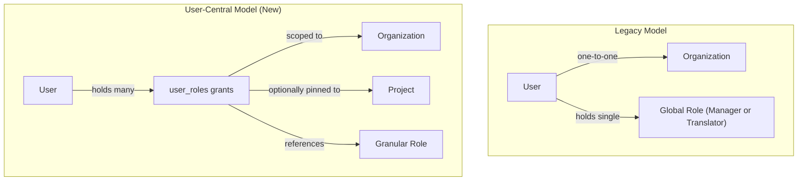
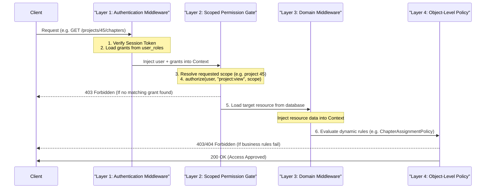

# RBAC Architecture Specification — User-Central Model

This document outlines the architecture, data-flow layers, and permissions of the User-Central Role-Based Access Control (RBAC) model.

---

## 1. How It Changed: Before vs. After

The system migrated from a rigid, single-tenant architecture to a multi-tenant, grant-driven ledger model.



### Legacy Architecture (Tenant-Central)

- **Rigid Linkage**: Every user was locked to exactly one organization via a `users.organization` Foreign Key.
- **Global Role**: Users held exactly one global role (`Manager` or `Translator`) in `users.role`.
- **Static Resolution**: Permissions were evaluated globally. Multi-tenancy was enforced via hardcoded WHERE clauses checking the user's home organization. A user could not participate in multiple organizations or projects with different access levels.

### New Architecture (User-Central)

- **Emergent Membership**: A user does not belong to a single home organization. Instead, organization membership is **emergent**—a user belongs to an organization if and only if they hold at least one grant (`user_role`) associated with that `orgId`.
- **Multi-Role & Multi-Tenant**: A single user identity can hold multiple roles scoped to different organizations and projects simultaneously (e.g., a Project Manager in Org A, and a Project Translator in Org B).
- **Decoupled Permissions**: Permissions are mapped to roles, roles are granted to users with scopes, and the system resolves access dynamically based on the resource scope.

---

## 2. What the Grant is Doing (Anatomy of a Grant)

A **grant** is a row in the `user_roles` ledger. It links a user identity to a role, bound to a specific scope.

### The Scope Fields

A grant contains two scoping dimensions:

1.  `orgId` (nullable) — The organization the role is active in.
2.  `projectId` (nullable) — The specific project the role is pinned to.

### Grant Scopes and Semantics

Depending on which scope fields are populated, the grant behaves differently:

| Scope                                              | Role Type                                             | Meaning                                                                                                                                                   |
| :------------------------------------------------- | :---------------------------------------------------- | :-------------------------------------------------------------------------------------------------------------------------------------------------------- |
| **Global** <br> `(orgId: null, projectId: null)`   | `SuperAdmin`                                          | The grant applies system-wide. The user has access to all resources in all organizations.                                                                 |
| **Org-Wide** <br> `(orgId: O, projectId: null)`    | `Org Owner` <br> `Org Manager` <br> `Project Manager` | The grant applies to all resources under organization `O`. An Org-Wide Project Manager has administrative control over all projects in that organization. |
| **Project-Pinned** <br> `(orgId: O, projectId: P)` | `Project Translator` <br> `Project Observer`          | The grant is strictly confined. A Project Translator only has update access to chapters/verses assigned to them _inside_ project `P` of organization `O`. |

---

## 3. How It Works: The 4-Layer Authorization Flow

Every incoming HTTP request goes through a structured, 4-layer validation pipeline to resolve permissions.



### Layer 1: Authentication Middleware (`authenticateUser`)

Verifies the session token, fetches the user's details, retrieves all their active grants from `user_roles`, groups them, and attaches the resulting `AppPolicyUser` to the request context.

### Layer 2: Scoped Permission Gate (`requirePermission`)

Executes general permission checks using a scope resolver (e.g. resolving `orgId` from the request body or `projectId` from URL parameters).
It runs the core authorization check:

```typescript
authorize(user, permission, { orgId, projectId });
```

If the user does not have a grant matching the scope that contains the required permission, the request is instantly rejected with `403 Forbidden`.

### Layer 3: Domain Middleware (`requireProjectAccess` / `requireUserAccess`)

If Layer 2 passes, this layer retrieves the specific resource (e.g. Project, Chapter, or User) from the database and places it in the request context. This prevents redundant database lookups in later steps.

### Layer 4: Object-Level Policy (`ProjectPolicy` / `UserPolicy` / `ChapterAssignmentPolicy`)

Evaluates dynamic, context-aware business logic. For example:

- **Self-Access**: Restoring permission if the requesting user's ID matches the target user's ID (`user.id === target.id`).
- **Double Lock**: Ensuring a Translator can only edit a chapter if they are specifically assigned to it, and if the chapter status is `DRAFT` or `PEER_CHECK`.

---

## 4. The Permissions Matrix

Below is the complete set of system permissions and how they map to the 6 roles within their resolved scopes.

| Permission Name           | SuperAdmin | Org Owner | Org Manager |     Project Manager      | Project Translator | Project Observer |
| :------------------------ | :--------: | :-------: | :---------: | :----------------------: | :----------------: | :--------------: |
| `project:view`            |     ✅     |    ✅     |     ✅      |            ✅            |         ✅         |        ✅        |
| `project:create`          |     ✅     |    ✅     |     ✅      |            ✅            |         ❌         |        ❌        |
| `project:update`          |     ✅     |    ✅     |     ✅      |            ✅            |         ❌         |        ❌        |
| `project:delete`          |     ✅     |    ✅     |     ✅      |            ✅            |         ❌         |        ❌        |
| `content:view`            |     ✅     |    ✅     |     ✅      |            ✅            |         ✅         |        ✅        |
| `content:assign`          |     ✅     |    ✅     |     ✅      |            ✅            |         ❌         |        ❌        |
| `content:update`          |     ✅     |    ✅     |     ✅      |            ✅            |  ✅ (Double Lock)  |        ❌        |
| `user:view`               |     ✅     |    ✅     |     ✅      |            ✅            |  ✅ (Self / Org)   |        ✅        |
| `user:create`             |     ✅     |    ✅     |     ✅      |            ✅            |         ❌         |        ❌        |
| `user:update`             |     ✅     |    ✅     |     ✅      |            ✅            |   ✅ (Self Only)   |        ❌        |
| `user:delete`             |     ✅     |    ❌     |     ❌      |            ❌            |         ❌         |        ❌        |
| `membership:revoke`       |     ✅     |    ✅     |     ✅      | ✅ (Project Pinned Only) |         ❌         |        ❌        |
| `role:assign:project`     |     ✅     |    ✅     |     ✅      |            ✅            |         ❌         |        ❌        |
| `role:assign:org_manager` |     ✅     |    ✅     |     ❌      |            ❌            |         ❌         |        ❌        |

---

## 5. Case Study: Cross-Organization Isolation

To demonstrate how the system prevents cross-tenant data leaks, consider the following scenario:

> **Scenario**: An Org Manager belonging to **Org A (ID 10)** attempts to invite a Translator to **Org B (ID 20)**.

1.  **Request Payload**: The manager sends a `POST /users/invite` with `orgId: 20`.
2.  **Scope Extraction**: The route's scope resolver (`orgFromBody`) extracts `20`.
3.  **Engine Evaluation**: The middleware calls `authorize(managerUser, 'user:create', { orgId: 20 })`.
4.  **Grant Search**: The authorization engine iterates through the manager's grants.
    - It finds a grant for Org 10 with the `USER_CREATE` permission.
    - It evaluates if this grant applies to Org 20. Because `10 !== 20`, the scope check fails.
    - No other grants match Org 20.
5.  **Result**: The request is instantly blocked with a `403 Forbidden` response. The Org Manager is unable to interact with or write to Org B.

---

## 6. Guardrails & Safety Mechanisms

The system employs several protection layers to guarantee multi-tenant security, prevent orphaned database states, and eliminate schema drift.

### A. Coarse-Grained Gate Checking (Unscoped Fallback)

For route paths that lack a specific scope resolver at Layer 2 (e.g. `GET /projects/:id` or generic user listings), the `requirePermission` middleware falls back to a **coarse-grained query**:

- Rather than evaluating against an empty scope `{}` (which restricts execution exclusively to `SuperAdmin`), it checks if the user possesses the required permission in **any** of their assigned grants.
- If the user holds the permission in _at least one_ grant (e.g. a Translator having `project:view` on Project A), they pass Layer 2.
- The exact scope is then validated downstream at Layer 4 (the Object-Level Policy) once the specific resource has been loaded from the database, preventing unauthorized data access while allowing legitimate scoped users to access the route.

### B. Transactional User-Creation Rollback

To prevent the creation of "orphaned users" (identities created in the database but possessing zero access grants due to a failure during role assignment), both the invitation and user creation flows are wrapped in transactional fallbacks:

- **Invitation Flow**: If the `grantRole` step fails during `createUserWithInvitation`, the system automatically issues deletes for the created Hono local user and the `better-auth` identity.
- **Direct Creation Flow**: If the `grantRole` step fails in `createUser`, the system rolls back the database state, deletes the created record, and returns a `500 Internal Server Error`.

### C. Schema Drift Mitigation

Because legacy authorization fields (`role`, `organization`) and tables (`project_users`) are completely removed from the TypeScript codebase, the live database schema must be actively pruned to match:

1.  **Generate Migration**: Developers must generate SQL migrations using Hono/Drizzle CLI tools:
    `npm run db:generate -- drop_legacy_rbac_columns`
2.  **Verify & Migrate**: The generated drop constraints and table deletions must be manually validated before execution via `npm run db:migrate`.
3.  **Sanitization**: The database repository methods (`insert`/`update`) explicitly strip out legacy input keys from request bodies to prevent unexpected SQL errors during client transitions.

### D. Org-Membership Project Isolation

To prevent cross-tenant user hijacking (where a user from Org A is added to a project in Org B without authorization), the project member assignment flow (`POST /projects/:projectId/users`) enforces the following validation:

- **Verification**: All user IDs submitted for project assignment are verified against the target project's organization membership.
- **Action**: If any of the user IDs do not hold an active grant in the organization, the request is rejected with a `404 Not Found` response (preventing user membership enumeration).

### E. Role-Granting Privilege Hierarchies

To prevent role escalation (where a lower-level user grants higher-level roles to others), the user creation (`POST /users`) and invitation (`POST /users/invite`) endpoints evaluate the caller's role privileges inside the `requireUserAccess` domain auth middleware before allowing user creation:

- **SuperAdmin**: Can only be assigned by a global SuperAdmin.
- **Org Owner**: Can only be assigned by a SuperAdmin or an existing Org Owner of the same organization.
- **Org Manager**: Requires the caller to hold the `ROLE_ASSIGN_ORG_MANAGER` permission.
- **Project Roles (Manager/Translator/Observer)**: Require the caller to hold the `ROLE_ASSIGN_PROJECT` permission.
- **Result**: If the caller's privileges do not meet these criteria, the request is immediately rejected with a `403 Forbidden` response.
