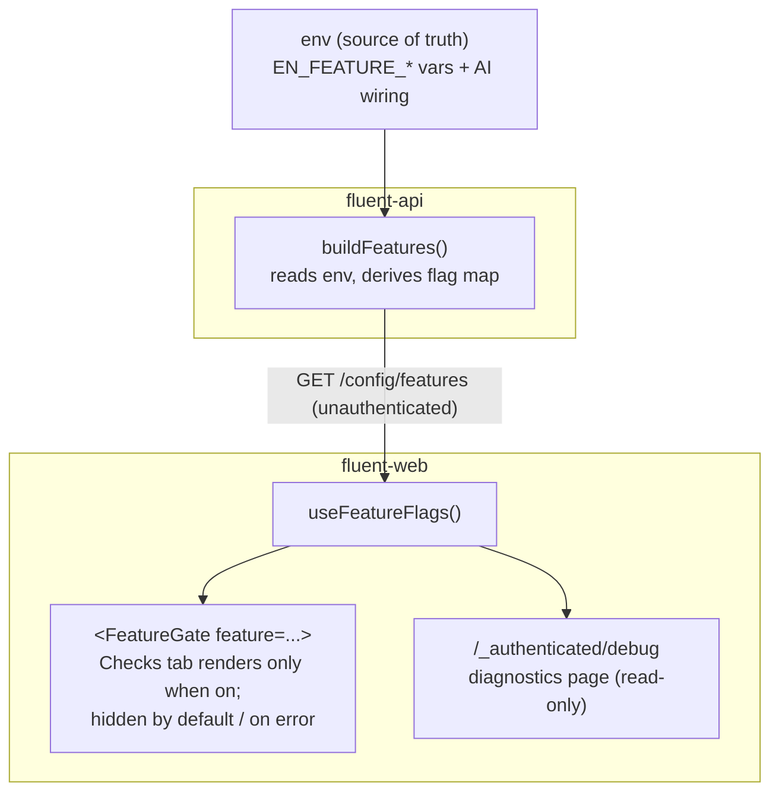

# Feature Flags via a Published Config Endpoint — Proposal

**Status:** Draft for review. Not yet implemented.
**Origin:** fluent-ai is not hosted in any deployed environment. Every PR that
depends on it therefore cannot merge — merging would light up UI (and code
paths) that call a service that isn't there, which would block promoting the
branch to production, which in turn blocks unrelated changes queued behind it.
**Ships as:** a coordinated pair of PRs — fluent-api (the flag source + endpoint)
and fluent-web (the consumer hook, a gate primitive, and an unlinked diagnostics
page). A small fluent-platform compose/env note may follow.

---

## 1. Problem

- fluent-ai has no hosted URL in `development`/`staging`/`production`. In those
  environments `FLUENT_AI_URL` / `FLUENT_AI_KEY` point at nothing usable.
- The AI-dependent feature that exists today is the **Repeated Word Check**
  (fluent-web Checks tab/panel → `POST /ai/tools/greek-room/repeated-words`).
- We need a way to **turn AI-dependent front-end features on and off per
  environment** so their PRs can merge and ride to production **hidden**, and be
  switched on later (in the environment where fluent-ai actually runs) with a
  config change and no redeploy of code.

This is fundamentally a **wiring / deploy concern**, not application data.

---

## 2. Goals & non-goals

**Goals**

- A single source of truth for "which optional features are on," owned by
  fluent-api and driven by environment configuration.
- A read-only endpoint fluent-web can query to decide what UI to render.
- fluent-web hides AI UI by default and reveals it only when the flag says so.
- An unlinked, login-gated diagnostics page where an operator can see the flag
  state (and, over time, other technical/health details).
- An **extensible** shape so the next feature/flag is added without changing the
  contract or the consumer primitives.

**Non-goals (this proposal)**

- **No server-side enforcement.** This is a _publishing_ mechanism, deliberately
  decoupled from the request path. Turning a flag off does **not** make
  `/ai/tools/...` start rejecting requests. If AI is unconfigured the AI call
  errors out on its own (a separate, pre-existing consequence — see §7). Coupling
  publish-state to enforcement is explicitly rejected (**D5**).
- **No database.** Flags are env-derived, not stored/edited at runtime (**D1**).
- **No runtime toggling UI.** The diagnostics page is read-only (**D8**).

---

## 3. Design overview



- fluent-api **owns the truth** (from env) and publishes a **read-only
  projection** of it. fluent-web never decides policy; it only reflects what the
  API reports. (This resolves the apparent "env vs API" split: the API is not a
  second source of truth, it is the _publication channel_ for the env truth.)

---

## 4. fluent-api: the flag source

### 4.1 Env variables — one flat var per flag, `EN_FEATURE_*` prefix — **D1, D2**

Each feature flag is its **own flat boolean env var** under a **dedicated
`EN_FEATURE_` prefix**. The prefix is hopefully specific enough not to collide with unrelated vars. Each flag
var is **declared explicitly in the Zod `EnvSchema`** in
[`src/env.ts`](../../../src/env.ts):

```ts
const EnvSchema = z.object({
  // ...existing vars...

  // ── Feature flags (EN_FEATURE_*) ──────────────────────────────────────
  // One flat boolean per optional feature. Each is declared explicitly (see
  // D2) so the schema doubles as the authoritative catalog of known flags and
  // validates values. All EN_FEATURE_* vars are swept into the published map
  // (§4.3); the key after the prefix is camelCased for the wire.
  //
  // Repeated Word Check (the one AI-dependent feature today). Left optional so
  // its default can be derived from AI wiring (§4.2).
  EN_FEATURE_REPEATED_WORD_CHECK: z.coerce.boolean().optional(),
});
```

**Why declare each flag in the schema (a deliberate DRY violation).** We could
sweep `process.env` for the prefix generically, but a fixed `z.object` **strips
unknown keys** on parse — so an undeclared `EN_FEATURE_*` var would be dropped
before we could read it. Rather than parse outside the schema, we **declare each
flag** so: (a) the schema is the single authoritative list of known flags —
useful documentation in its own right, alongside the existing
[`.env.example`](../../../.env.example) (which already carries a "# Fluent-AI
integration" section we extend); (b) values are validated/coerced like every
other env var; (c) there are no surprises from stray env keys. Adding a flag is:
one schema line + one `.env.example` line + one map entry (§4.3).

### 4.2 Per-flag default — AI-wiring safety for the repeated-word check — **D2**

The repeated-word-check flag is an explicit switch that **defaults to off when
AI is not wired**:

- If `EN_FEATURE_REPEATED_WORD_CHECK` is set explicitly → use it.
- If unset → derive: `true` only when **both** `FLUENT_AI_URL` and
  `FLUENT_AI_KEY` are present and non-empty; otherwise `false`.

This is belt-and-suspenders: an operator can force it, but forgetting to set it
in an environment where fluent-ai isn't wired yields the safe answer (off). It
does **not** enforce anything — it only decides what we _publish_ (**D5**).
Future non-AI flags need not carry this derivation; they can simply default to
`false` when unset.

### 4.3 Endpoint — **D3, D4**

Add a **meta route** as a sibling of [`/health`](../../../src/routes/health.route.ts)
in `src/routes/`:

```
GET /config/features            (unauthenticated — see Q1)
200 →
{
  "features": {
    "repeatedWordCheck": true
  }
}
```

- Placed in `src/routes/config.route.ts`, registered on `server` like
  `health.route.ts`. `/config` namespaces future non-feature config cleanly.
- Returns a **named map** (`features: { <key>: boolean }`), never a bare boolean,
  so new flags are additive (**D6**). The map is assembled from the declared
  `EN_FEATURE_*` vars: the part after the prefix is **camelCased** for the wire
  (`EN_FEATURE_REPEATED_WORD_CHECK` → `repeatedWordCheck`). Today the only key is
  `repeatedWordCheck`, whose value is the effective flag from §4.2.
- Response schema via `@hono/zod-openapi` so it appears in the OpenAPI doc like
  every other route.

**Alternative floated (not chosen): fold into `/health`.** "What services are
enabled" is arguably a health/readiness concern, and `/health` is already
unauthenticated and env-derived. We could instead extend the health payload with
a `features` block and skip a new route. Downside: it overloads a liveness probe
with product-config semantics and couples two audiences (uptime monitors vs. the
SPA). **Recommendation: dedicated `/config/features`; reviewer may prefer the
`/health` merge (Q2).**

---

## 5. fluent-web: consuming the flags

### 5.1 A small, extensible primitive — **D6, D7**

Add a feature-flags module (e.g. `src/features/flags/`) with:

- **`useFeatureFlags()`** — a TanStack Query hook that GETs `/config/features`
  and returns the typed `features` map. Cached like other config; a sensible
  `staleTime` (flags change only on deploy/config).
- **`useFeatureFlag(name)`** — thin selector returning a single boolean.
- **`<FeatureGate feature="repeatedWordCheck">…</FeatureGate>`** — renders
  children only when the named flag is on.

The map shape (`Record<FeatureName, boolean>`) means adding a feature later is a
new key + a new gate usage — **no change to the hook or the component** (**D6**).

### 5.2 Fail closed (hidden) — **D7**

While flags are **loading**, or if the endpoint **errors/unreachable**, gated AI
UI is **treated as off (hidden)**. This is the safe default given the entire
point is "don't surface features whose backend isn't there." Non-AI/base UI is
never gated and renders normally regardless.

### 5.3 Wiring the one feature today

The Checks tab/panel in the drafting area (repeated-word check) is wrapped so it
appears only when `repeatedWordCheck` is on. Relevant surfaces:

- Checks panel — `fluent-web/src/features/checks/components/ChecksPanel.tsx`
- Drafting page host — `fluent-web/src/features/bible/components/DraftingPage.tsx`

Exact insertion point is an implementation detail for the fluent-web PR; the
contract here is only "gate the AI UI on `repeatedWordCheck`, default hidden."

---

## 6. fluent-web: the diagnostics page — **D8**

An **unlinked** page under the existing `_authenticated` layout (login required,
**no** role check), e.g. route `/_authenticated/debug` (final path TBD in the
web PR). Precedent: the router already has a login gate via `_authenticated` and
a Manager-only gate on `/users` — we intentionally use only the login gate here.

- **Unlinked by design**: no nav entry. "If you know about it, you know about
  it." The URL is _obscurity, not a security boundary_ — note the underlying
  endpoint is unauthenticated (Q1), so nothing sensitive should ever live here.
- **Read-only**: displays the flag map as the API reports it. No toggles.
- **Framing / future use**: a `chrome://`-style catch-all for technical details
  — whoever keeps things running peeks here to see what's on/off and, over time,
  other health/technical info (build/version, `/health` echo, env name, etc.).
  So it is scoped as "diagnostics page that currently shows feature flags,"
  not "the feature-flags page."

---

## 7. Interaction with the actual AI call path (out of scope, noted)

Because there is **no enforcement** (**D5**), a client that hits
`/ai/tools/greek-room/repeated-words` while the flag is off still reaches the
existing proxy, which will fail on its own if fluent-ai is unreachable (the
client already maps this to `AI_SERVICE_UNAVAILABLE` → 502; see
[`fluent-ai.client.ts`](../../../src/lib/services/fluent-ai/fluent-ai.client.ts)).
That is a **pre-existing, separate consequence** of AI not being wired — this
proposal neither introduces nor removes it. The flag's job is purely to keep the
UI (and thus normal users) away from that path in environments where it can't
work.

---

## 8. Decisions

| ID  | Decision                                                                                                                                                                                                          | Rationale                                                                                                                                                                                                                     |
| --- | ----------------------------------------------------------------------------------------------------------------------------------------------------------------------------------------------------------------- | ----------------------------------------------------------------------------------------------------------------------------------------------------------------------------------------------------------------------------- |
| D1  | Flags are **env-sourced, not stored in the DB**.                                                                                                                                                                  | This is a deploy/wiring concern. A DB adds a migration + admin surface for something that changes only when infra changes.                                                                                                    |
| D2  | **One flat boolean env var per flag under the `EN_FEATURE_*` prefix**, each **declared explicitly in the Zod schema**. The repeated-word-check flag defaults OFF when `FLUENT_AI_URL`/`FLUENT_AI_KEY` are absent. | Specific prefix avoids collisions; declaring each flag makes the schema the authoritative catalog and survives Zod's unknown-key stripping. Operator can force it; forgetting it where AI isn't wired yields the safe answer. |
| D3  | Expose via a **dedicated meta route `GET /config/features`** in `src/routes/`, sibling of `/health`.                                                                                                              | Matches the `/health` precedent (unauthenticated, env-derived, DB-less). `/config` leaves room to grow.                                                                                                                       |
| D4  | Response is a **named map** `{ features: { <key>: boolean } }` assembled from the `EN_FEATURE_*` vars (prefix stripped, camelCased).                                                                              | Additive: new flags need no contract change; env keys never leak verbatim onto the wire.                                                                                                                                      |
| D5  | **No server-side enforcement.** Publishing is decoupled from the AI request path.                                                                                                                                 | Keeps the flag a pure signal; enforcement/behavior on missing AI is a separate, pre-existing concern.                                                                                                                         |
| D6  | fluent-web consumes flags through a **reusable `useFeatureFlags` hook + `FeatureGate` primitive** over a `Record<name, boolean>`.                                                                                 | Adding a feature later is a key + a gate usage, nothing more.                                                                                                                                                                 |
| D7  | AI/gated UI **fails closed (hidden)** while loading or on endpoint error.                                                                                                                                         | The whole point is to not surface features whose backend isn't there.                                                                                                                                                         |
| D8  | A **login-gated, unlinked, read-only diagnostics page** hosts the flag view (extensible to other technical/health info).                                                                                          | Reuses the existing `_authenticated` gate; "know the URL" access; grows into a `chrome://`-style ops page.                                                                                                                    |

---

## 9. Open questions for the reviewer

1. **Endpoint auth (Q1).** This proposal makes `GET /config/features`
   **unauthenticated** (like `/health`), on the grounds that it reveals only
   "is an optional feature on" — no data, no secrets — and lets the SPA decide
   what to render independent of login. **Is unauthenticated acceptable here, or
   should it require a session?** (If it must be authed, the diagnostics page's
   login gate becomes a real boundary rather than mere obscurity.)
2. **Route vs. `/health` (Q2).** Dedicated `GET /config/features` (recommended)
   vs. folding a `features` block into the existing `/health` payload, since
   "what's enabled" is arguably a health concern. Preference?
3. **Prefix & map key (Q3).** Is `EN_FEATURE_*` the right prefix (specific
   enough to avoid collisions), and `EN_FEATURE_REPEATED_WORD_CHECK` →
   `repeatedWordCheck` the right var/key naming (vs. `greekRoomRepeatedWords`,
   `aiRepeatedWords`, etc.)? Also: are we comfortable declaring each flag var
   explicitly in the schema (a small DRY cost that buys documentation +
   validation), vs. a generic prefix sweep?
4. **Default-derivation (Q4).** Deriving the unset default of
   `EN_FEATURE_REPEATED_WORD_CHECK` from `FLUENT_AI_URL`/`FLUENT_AI_KEY`
   presence — desirable safety, or too clever (prefer a plain default of `false`
   and require operators to set it)?

---

## 10. Rollout

1. **fluent-api PR** — add `EN_FEATURE_REPEATED_WORD_CHECK` to the env schema and
   to [`.env.example`](../../../.env.example), add the `buildFeatures()` deriver
   (sweep declared `EN_FEATURE_*` → camelCased map, with the AI-wiring default),
   the `GET /config/features` route + OpenAPI schema + tests. Merges safely:
   default is off wherever AI isn't wired.
2. **fluent-web PR** — add `useFeatureFlags`/`FeatureGate`, gate the Checks UI
   (default hidden), add the unlinked diagnostics page. Merges safely: with the
   flag off (prod), the Checks UI simply doesn't render — unblocking the AI PRs.
3. **Later, per environment** — set `EN_FEATURE_REPEATED_WORD_CHECK=true` (and
   wire `FLUENT_AI_URL`/`FLUENT_AI_KEY`) wherever fluent-ai is actually hosted.
   No code redeploy required to flip it.
