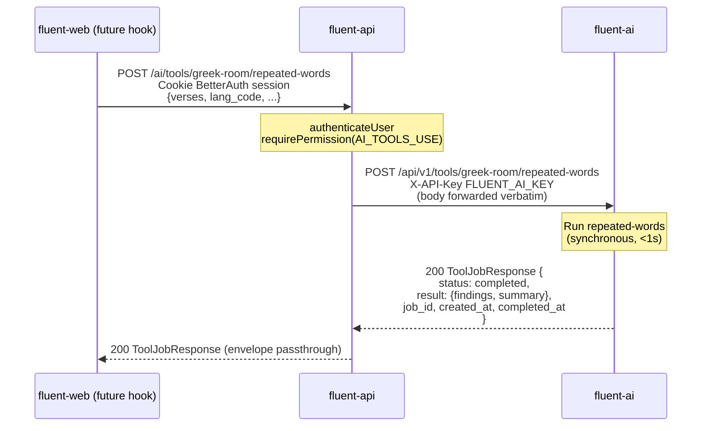
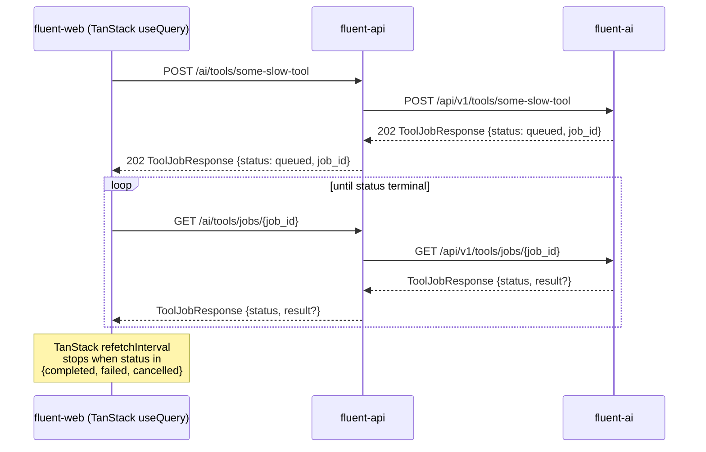

# AI-Tools Integration on fluent-api — Proposal

**Status:** Draft for review.
**Scope:** Extend fluent-api to expose AI tools implemented by fluent-ai, starting with Greek-Room's _Repeated Words_ check. The exposed pattern is meant to absorb every future AI tool (LLM drafting, embeddings, fine-tuning, other Greek-Room checks) without renegotiating the contract.
**Companion document:** [`fluent-api/proposals/ai-tools-integration-summary.md`](ai-tools-integration-summary.md) — short reviewer orientation.
**Predecessors on the fluent-ai side:** [`fluent-ai/greek-room-integration-summary.md`](../../fluent-ai/greek-room-integration-summary.md), [`fluent-ai/greek-room-integration-suggestion.md`](../../fluent-ai/greek-room-integration-suggestion.md), [`fluent-ai/greek-room-integration-decisions.md`](../../fluent-ai/greek-room-integration-decisions.md).

---

## 1. Background

fluent-ai is the Python/FastAPI backend dedicated to AI-tool integrations. It has merged its first such integration — Greek-Room's _Repeated Words_ check — exposed at:

```
POST /api/v1/tools/greek-room/repeated-words
Header: X-API-Key: <key>
```

with a `ToolJobResponse[RepeatedWordsResult]` envelope that already accommodates a future async-queue mode (`status: queued|running|completed|failed|cancelled`, `job_id`, `created_at`, `completed_at`). Today it always returns `status: "completed"` synchronously; the queue substrate is deferred until a slow tool needs it. See the predecessor documents linked above for the full architectural rationale.

fluent-api is the Node/TypeScript backend that fronts the editor (fluent-web). It currently has no awareness of fluent-ai. This proposal describes how to put the _Repeated Words_ check on the menu by routing it through fluent-api, while shaping the integration so the next AI tool drops in with minimum effort.

The user-facing motivation is the editor: eventually each repeated word should get a corrective squiggle below it, similar to a spell-checker. That endgame is **out of scope for this PR**, but it sets the constraint that the surface fluent-api exposes must be cheap and re-callable per editor save, not stateful or session-coupled.

### 1.1 Related repositories

All four sibling projects live under the same GitHub org (`eten-tech-foundation`). Per fluent-platform's setup convention they are cloned side-by-side in the same parent directory.

| Repo                | Remote                                                                                                     | Role                                                                                                                                           |
| ------------------- | ---------------------------------------------------------------------------------------------------------- | ---------------------------------------------------------------------------------------------------------------------------------------------- |
| **fluent-api**      | [github.com/eten-tech-foundation/fluent-api](https://github.com/eten-tech-foundation/fluent-api)           | Node/TypeScript REST API (Hono + Drizzle + BetterAuth). The subject of this proposal.                                                          |
| **fluent-ai**       | [github.com/eten-tech-foundation/fluent-ai](https://github.com/eten-tech-foundation/fluent-ai)             | Python/FastAPI service hosting AI-tool integrations (Greek-Room, future LLM tools). The upstream we are calling into.                          |
| **fluent-platform** | [github.com/eten-tech-foundation/fluent-platform](https://github.com/eten-tech-foundation/fluent-platform) | Container-first orchestrator. Owns the shared PostgreSQL, the unified compose stack, and helper scripts. Touched by this proposal — see §12.4. |
| **fluent-web**      | [github.com/eten-tech-foundation/fluent-web](https://github.com/eten-tech-foundation/fluent-web)           | React/Vite frontend (the editor). Not touched in this PR; the frontend hook is a follow-up.                                                    |

Relative paths in this document (e.g. `../../fluent-platform/...`) assume the standard side-by-side layout that fluent-platform's setup script produces.

---

## 2. Scope of this PR

**In scope (this PR):**

1. A single new endpoint on fluent-api: `POST /ai/tools/greek-room/repeated-words`.
2. A shared utility — `callFluentAi<TReq, TResult>(toolPath, body, schema)` — used by all per-tool routes to handle envelope unwrap, error translation, and (later) polling.
3. A new domain folder, `src/domains/ai-tools/`, containing routes/services/types for tool endpoints.
4. Two new env vars wired through `src/env.ts`: `FLUENT_AI_URL` and `FLUENT_AI_KEY`.
5. A new permission alias `PERMISSIONS.AI_TOOLS_USE` that maps to the same underlying value as `CONTENT_UPDATE`.
6. Tests mirroring the existing fluent-api test patterns plus one smoke test runnable from the host.

**Explicitly deferred (future PRs):**

- Async job polling endpoint on fluent-api (`GET /ai/tools/jobs/{job_id}` or similar). Not built because fluent-ai also has not built the corresponding endpoint yet — both sides chose "lightweight now" per fluent-ai decision **D1**.
- Frontend (fluent-web) hooks and squiggle UI. Frontend is a separate session/PR.
- DB persistence of tool runs / findings. No `ai_tool_runs` or `check_results` table is introduced.
- Net-new cross-repo docker orchestration. The substrate already exists as [`fluent-platform`](../../fluent-platform/README.md); this PR adds two small entries (`FLUENT_AI_URL` override) to [`fluent-platform/compose.yaml`](../../fluent-platform/compose.yaml) and ships them alongside the fluent-api change. See §12 for details.
- Rate limits, request-size limits, MCP facade, SSE/WebSocket streaming, scheduled runs, multi-tenant fairness. All deferred at the fluent-ai level and inherited here.

---

## 3. Architectural decisions summary

These are the decisions captured during the spec discussion. Each is restated here so reviewers can discuss the conclusion without reading the supporting analysis.

| #       | Decision                                                                                                                                                                                                                                                                                                                                | Short rationale                                                                                                                                                                                                                                                                                                                                                                                                                                  |
| ------- | --------------------------------------------------------------------------------------------------------------------------------------------------------------------------------------------------------------------------------------------------------------------------------------------------------------------------------------- | ------------------------------------------------------------------------------------------------------------------------------------------------------------------------------------------------------------------------------------------------------------------------------------------------------------------------------------------------------------------------------------------------------------------------------------------------ |
| **D1**  | PR scope is "minimum proxy" — no DB persistence, no job queue exercised in this PR.                                                                                                                                                                                                                                                     | Repeated-words is fast (<1s) and re-runnable; persistence is not motivated by this tool. Defer until a slow tool justifies a `ai_tool_runs` table.                                                                                                                                                                                                                                                                                               |
| **D2**  | URL is `POST /ai/tools/greek-room/repeated-words`.                                                                                                                                                                                                                                                                                      | Introduces `/ai/` as fluent-api's first top-level service-family namespace. Telegraphs "network-bound, potentially slow, possibly async" — characteristics that local CRUD endpoints don't share. Per-tool URL preserves OpenAPI type-safety. Alternatives: `/checks/repeated-words` (more in convention but hides the proxy nature), nested under `/chapter-assignments/{id}/` (requires server-side enrichment which we reject in D8).         |
| **D3**  | Polling lives in the _browser_ via TanStack Query's `refetchInterval`, not in fluent-api. fluent-api is a thin pass-through for both kickoff and (future) polling.                                                                                                                                                                      | Decouples slow tools from fluent-api's request budget. Aligns with fluent-web's existing TanStack Query usage. The polling code path is not exercised today because fluent-ai always returns `status: "completed"` synchronously.                                                                                                                                                                                                                |
| **D4**  | File layout: shared utility at [`fluent-api/src/lib/services/fluent-ai/fluent-ai.client.ts`](../src/lib/services/fluent-ai/fluent-ai.client.ts); per-tool routes/services in [`fluent-api/src/domains/ai-tools/`](../src/domains/ai-tools/). One route file for all tools; per-tool Zod schemas keep OpenAPI documentation fully typed. | Mirrors the existing [`fluent-api/src/lib/services/notifications/mailgun.service.ts`](../src/lib/services/notifications/mailgun.service.ts) pattern for "free functions wrapping a third-party API" and the existing [`fluent-api/src/lib/db-retry.ts`](../src/lib/db-retry.ts) pattern for "higher-order utility used by many call sites." Avoids a single one-size-fits-all dispatcher that would degrade OpenAPI schemas to `dict[str, Any]`. |
| **D5**  | Service discovery / docker networking is handled by the existing [`fluent-platform`](../../fluent-platform/README.md) orchestrator. This PR adds two env vars on the fluent-api side and one `environment:` override on the fluent-platform side (`FLUENT_AI_URL: http://ai:8200`). See §12.                                            | fluent-platform already wires `db`, `api`, `worker`, `ai`, `web` together on a shared network; we plug in to that substrate rather than invent a new one.                                                                                                                                                                                                                                                                                        |
| **D6**  | A single shared `FLUENT_AI_KEY` is provisioned for the fluent-api → fluent-ai hop. If another consumer of fluent-ai appears later, it gets its own key.                                                                                                                                                                                 | Per-user keys give zero security benefit at this layer (everyone going through fluent-api is already authenticated to fluent-api). Single key minimizes IT complexity.                                                                                                                                                                                                                                                                           |
| **D7**  | Error translation specifics deferred to implementation. If conformity between the two error systems is awkward, prefer harmonizing fluent-ai toward fluent-api's patterns rather than the other way.                                                                                                                                    | At the spec level there are no hard constraints; the safe defaults (5xx from fluent-ai → 502 on fluent-api with `ErrorCode.AI_SERVICE_UNAVAILABLE`) are obvious.                                                                                                                                                                                                                                                                                 |
| **D8**  | No request enrichment. fluent-api forwards the request body to fluent-ai verbatim. fluent-web sends the full `RepeatedWordsRequest` shape including `lang_code`, `lang_name`, `project_id`, `project_name`, `verses[]`.                                                                                                                 | Maximum flexibility for the caller. Avoids coupling fluent-api to fluent-ai's request schema (today and tomorrow).                                                                                                                                                                                                                                                                                                                               |
| **D9**  | The full `ToolJobResponse` envelope is passed through to fluent-web unchanged. No unwrap to `result` for the synchronous case.                                                                                                                                                                                                          | Forward-compatible with TanStack-based polling — the same hook code consumes the envelope today (`status: completed`) and tomorrow (`status: queued` → polled to `completed`).                                                                                                                                                                                                                                                                   |
| **D10** | Auth on the new endpoint: introduce `PERMISSIONS.AI_TOOLS_USE` as an _alias_ with the same underlying value as `CONTENT_UPDATE`.                                                                                                                                                                                                        | Cosmetically separates "can edit content" from "can invoke AI tools" without making a real distinction yet. Trivial to peel apart later.                                                                                                                                                                                                                                                                                                         |
| **D11** | A smoke test analogous to [`fluent-ai/scripts/smoke_repeated_words.py`](../../fluent-ai/scripts/smoke_repeated_words.py) is added, runnable from the host with both services up.                                                                                                                                                        | Lets devs verify the cross-service plumbing without running the full vitest suite.                                                                                                                                                                                                                                                                                                                                                               |
| **D12** | This work ships as a **coordinated pair of PRs**: one against fluent-api (the bulk of the work) and one small PR against fluent-platform (compose env-var override + 1–2 README lines). Either order of merge is fine; both should be ready for review together.                                                                        | The fluent-platform PR is small and contains no logic, so it can land first to unblock ecosystem-mode dev. Reviewers should be able to read both PRs side-by-side.                                                                                                                                                                                                                                                                               |

---

## 4. End-to-end picture

### 4.1 Today (synchronous, status = "completed")



### 4.2 Tomorrow (async, status = "queued" → polled)



The interesting property: **the request/response shapes are identical** between 4.1 and 4.2. The only difference is `status` and whether `result` is populated. fluent-web's hook composes a `useMutation` for kickoff with a conditional `useQuery` that polls iff `status === "queued" | "running"`.

---

## 5. URL and endpoint shape

### 5.1 The URL

```
POST /ai/tools/greek-room/repeated-words
```

This introduces `/ai/` as fluent-api's first top-level service-family namespace. The full URL inventory survey conducted during the spec session is reproduced in [Appendix A](#appendix-a--fluent-api-url-inventory-at-time-of-writing). Today fluent-api's URLs are flat, plural-noun, unprefixed; nested URLs reflect ownership (`/projects/{id}/users`). There is no existing service-family namespace; `/usfm` _is not_ a top-level prefix but a nested sub-resource under `/project-units/{id}`.

#### Why `/ai/tools/greek-room/repeated-words` over the alternatives

- **`/checks/repeated-words`** would be more in-convention (two segments, domain noun, hides the proxy nature). It was the leading candidate during the spec discussion and is preserved as an alternative. Its weakness is informational: the URL gives no hint about the network hop, which makes it harder to reason about timeouts, error budgets, and observability when the system grows.
- **`/tools/greek-room/repeated-words`** (mirroring fluent-ai exactly) loses the "AI service" signal but keeps the per-tool path. Same departure-from-convention cost as the chosen option, with less informational payload.
- **`/chapter-assignments/{id}/checks/repeated-words`** (nesting under the editable subject) would be the most in-convention nesting style. It is unsuitable here because pass-through input (D8) means the parent ID would not actually be consulted server-side — it would lie about the resource model. Honorable mention only.

#### Forward compatibility under `/ai/`

The path layout makes room for the polling endpoint without name collisions:

- `POST /ai/tools/{family}/{tool-name}` — kickoff (this PR for `greek-room/repeated-words`).
- `GET /ai/tools/jobs/{job_id}` — poll (future, when first slow tool ships).

Note that the existing [`fluent-api/src/domains/usfm/usfm.route.ts`](../src/domains/usfm/usfm.route.ts) already owns `GET /jobs/{job_id}` for pg-boss USFM-export polling. **Keeping the AI-tools polling endpoint under `/ai/tools/jobs/{id}` avoids that collision** and lets the two job systems coexist with different response shapes (pg-boss-native vs. fluent-ai's `ToolJobResponse` envelope).

### 5.2 OpenAPI documentation

Each tool gets its own `createRoute({...})` call in [`fluent-api/src/domains/ai-tools/ai-tools.route.ts`](../src/domains/ai-tools/ai-tools.route.ts) with:

- A typed `RepeatedWordsRequestSchema` (Zod schema mirroring fluent-ai's `RepeatedWordsRequest`).
- A typed `RepeatedWordsResponseSchema` wrapping the `ToolJobResponse[RepeatedWordsResult]` envelope.
- Proper 4xx/5xx response schemas using the existing `Result<T>` → HTTP-status conventions ([`fluent-api/src/lib/types.ts`](../src/lib/types.ts)).

This means the `/reference` Scalar docs at fluent-api's root will display the full request/response shape for each tool. No `dict[str, Any]` degradation. Adding a new tool means adding a new `createRoute(...)` block in the same file, registering it on the OpenAPIHono app — three to ten lines plus schemas.

---

## 6. File layout

```
fluent-api/src/
├── env.ts                                       # +FLUENT_AI_URL, +FLUENT_AI_KEY
│
├── lib/
│   ├── permissions.ts                            # +PERMISSIONS.AI_TOOLS_USE (alias of CONTENT_UPDATE)
│   ├── types.ts                                  # +ErrorCode.AI_SERVICE_UNAVAILABLE, +ErrorCode.AI_TOOL_EXECUTION_FAILED
│   └── services/
│       └── fluent-ai/                            # NEW
│           ├── fluent-ai.client.ts               # callFluentAi<TReq, TResult>(toolPath, body, schema): Result<ToolJobResponse<TResult>>
│           └── fluent-ai.types.ts                # ToolJobResponse<T>, JobStatus union, ToolJobError shape
│
├── domains/
│   └── ai-tools/                                 # NEW
│       ├── ai-tools.route.ts                     # POST /ai/tools/greek-room/repeated-words (per-tool routes go here)
│       ├── ai-tools.service.ts                   # callRepeatedWords(req): one-line wrappers per tool
│       └── ai-tools.types.ts                     # Per-tool Zod schemas: RepeatedWordsRequestSchema, RepeatedWordsResultSchema, ...
│
└── server/
    └── server.ts                                 # Register ai-tools routes (mirrors how existing domains register)
```

### 6.1 Why this layout

The fluent-api codebase already has the right precedent for both pieces:

- **`lib/services/fluent-ai/`** mirrors [`fluent-api/src/lib/services/notifications/mailgun.service.ts`](../src/lib/services/notifications/mailgun.service.ts) — free functions exported from a service file under `lib/services/{vendor}/{vendor}.service.ts`. The Mailgun file returns `Promise<Result<T>>` and reads its credentials directly from `process.env`. Our `callFluentAi` follows the same shape.
- **`callFluentAi` as a higher-order utility** mirrors [`fluent-api/src/lib/db-retry.ts`](../src/lib/db-retry.ts)'s `withDatabaseRetry<T>(operation, options)` pattern. One shared utility, many call sites, no code duplication, no over-generalization.
- **`domains/ai-tools/`** as a domain folder mirrors every other domain in the codebase (`domains/projects/`, `domains/translated-verses/`, etc.). Routes/services/types separated. Hono `createRoute` per endpoint. `Result<T>` returned from services and converted via `getHttpStatus(error)` in routes.

### 6.2 Why not a generic dispatcher

A generic `POST /ai/dispatch` endpoint accepting `{tool: string, params: unknown}` was considered and rejected (this echoes the fluent-ai-side decision **D2** in [`fluent-ai/greek-room-integration-decisions.md`](../../fluent-ai/greek-room-integration-decisions.md)). The reasons are the same in TypeScript-land:

- OpenAPI/Scalar docs would degrade to `unknown` payloads.
- Each new tool would lose its named, typed request/response in the docs.
- Per-tool observability (route-level logging, request-time histograms) becomes harder.
- A future MCP facade can still be layered on top of per-tool URLs without invalidating them.

### 6.3 Why one route file for all tools instead of one per tool

`ai-tools.route.ts` co-locates every tool endpoint so adding a new tool requires touching exactly two files (`ai-tools.service.ts` for the wrapper, `ai-tools.route.ts` for the route + schemas). When this file becomes uncomfortably large (~5+ tools), a split by tool _family_ — `ai-tools.greek-room.route.ts`, `ai-tools.openai.route.ts`, etc. — is the natural next step. Not warranted at one tool.

---

## 7. The shared utility: `callFluentAi`

The single piece of _new mechanism_ this PR introduces is the function in [`fluent-api/src/lib/services/fluent-ai/fluent-ai.client.ts`](../src/lib/services/fluent-ai/fluent-ai.client.ts).

### 7.1 Signature

```ts
import { z } from '@hono/zod-openapi';

import type { Result } from '@/lib/types';

import type { ToolJobResponse } from './fluent-ai.types';

export async function callFluentAi<TReq, TResult>(
  toolPath: string, // e.g. 'tools/greek-room/repeated-words' (no leading slash; no /api/v1)
  body: TReq,
  resultSchema: z.ZodType<TResult>, // for runtime validation of the result field on success
  options?: {
    signal?: AbortSignal; // honored if caller wants timeout / cancellation
    timeoutMs?: number; // default 30_000
  }
): Promise<Result<ToolJobResponse<TResult>>>;
```

### 7.2 What it does

1. Reads `env.FLUENT_AI_URL` and `env.FLUENT_AI_KEY` (validated at boot in [`fluent-api/src/env.ts`](../src/env.ts)).
2. POSTs to `${FLUENT_AI_URL}/api/v1/${toolPath}` with:
   - `Content-Type: application/json`
   - `X-API-Key: ${FLUENT_AI_KEY}`
   - body serialized as JSON
3. Honors the caller's `AbortSignal` if provided; otherwise applies a default 30-second timeout via a derived signal. (Tunable per-call.)
4. On HTTP-level success (2xx), parses the response body as `ToolJobResponse<TResult>` and validates the `result` field against `resultSchema` _if and only if_ `status === "completed"`. (When status is `queued|running`, `result` is `null` and is not validated.)
5. Returns `{ ok: true, data: envelope }` — note this is the **full envelope**, not the unwrapped result. Callers that care only about the synchronous-completed case can `if (envelope.status === "completed") return envelope.result`. Callers that want to support the future polling case can inspect `envelope.status` and `envelope.job_id`.
6. On HTTP error (4xx/5xx), network error, parse error, or schema-validation error, returns `{ ok: false, error: {...} }` using the error mapping in §9.

### 7.3 What it does **not** do (in this PR)

- It does not poll. A `pollUntilComplete: true` option, or a sibling `pollToolJob(jobId, resultSchema)` function, can be added in the future PR that ships the first slow tool. Today the polling code path is not in scope because fluent-ai has not yet shipped the polling endpoint either.
- It does not cache. Each call is independent. Per-tool caching (e.g. memoizing on `(toolPath, hash(body))`) is a future optimization for expensive idempotent tools.
- It does not retry on transport failure. `withDatabaseRetry`-style retries are intentionally not applied because most AI tool failures are _semantic_, not _transport-flaky_. If a user-facing retry policy is wanted, it belongs at the route layer or in the frontend hook, not in this utility.

### 7.4 Why this shape

Compare it to the existing utilities it's modeled on:

- [`withDatabaseRetry<T>(operation, options)`](../src/lib/db-retry.ts) is a higher-order async wrapper. `callFluentAi` is also a higher-order async wrapper, parameterized by request/result types and the runtime Zod schema.
- [`sendInvitationEmail({email, ticketUrl, ...})`](../src/lib/services/notifications/mailgun.service.ts) is a free function in `lib/services/` that wraps a third-party API and returns `Promise<Result<T>>`. `callFluentAi` is a free function in `lib/services/` that wraps a third-party API and returns `Promise<Result<T>>`.

The point of `callFluentAi` is **not** to be the only function callers ever touch. Each tool gets a typed wrapper in [`ai-tools.service.ts`](../src/domains/ai-tools/ai-tools.service.ts) that calls `callFluentAi` once. The wrapper is what the route file imports; the shared utility is a private implementation detail.

### 7.5 Example per-tool wrapper

```ts
// fluent-api/src/domains/ai-tools/ai-tools.service.ts

import type { ToolJobResponse } from '@/lib/services/fluent-ai/fluent-ai.types';
import type { Result } from '@/lib/types';

import { callFluentAi } from '@/lib/services/fluent-ai/fluent-ai.client';

import type { RepeatedWordsRequest, RepeatedWordsResult } from './ai-tools.types';

import { RepeatedWordsResultSchema } from './ai-tools.types';

export async function callRepeatedWords(
  req: RepeatedWordsRequest
): Promise<Result<ToolJobResponse<RepeatedWordsResult>>> {
  return callFluentAi('tools/greek-room/repeated-words', req, RepeatedWordsResultSchema);
}
```

Adding a future tool (say, `coherence-check`) is the same five-line pattern:

```ts
export async function callCoherenceCheck(
  req: CoherenceCheckRequest
): Promise<Result<ToolJobResponse<CoherenceCheckResult>>> {
  return callFluentAi('tools/some-family/coherence-check', req, CoherenceCheckResultSchema);
}
```

### 7.6 Module-level singleton vs. per-call config

`callFluentAi` reads env at module scope, not per call. This means changing `FLUENT_AI_URL` or `FLUENT_AI_KEY` requires restarting fluent-api — same property as Mailgun, pg-boss, BetterAuth, AppInsights, all of which already work this way in fluent-api. For tests, dependency injection of a base URL is achieved by stubbing `fetch` (vitest's `vi.spyOn(global, 'fetch')`), not by passing config to `callFluentAi`. This matches the existing test conventions in fluent-api.

---

## 8. Request and response shapes

### 8.1 The forward direction (fluent-web → fluent-api → fluent-ai)

Per **D8** (no enrichment), the request body shape on `POST /ai/tools/greek-room/repeated-words` is **identical** to fluent-ai's `RepeatedWordsRequest`. Codified in Zod in [`fluent-api/src/domains/ai-tools/ai-tools.types.ts`](../src/domains/ai-tools/ai-tools.types.ts):

```ts
export const VerseInputSchema = z.object({
  snt_id: z.string().min(1),
  text: z.string(),
});

export const RepeatedWordsRequestSchema = z.object({
  lang_code: z.string().min(1),
  lang_name: z.string().min(1),
  project_id: z.union([z.string(), z.number()]),
  project_name: z.string().min(1),
  verses: z.array(VerseInputSchema).min(1),
});

export type RepeatedWordsRequest = z.infer<typeof RepeatedWordsRequestSchema>;
```

Notes:

- `project_id` is intentionally permissive (`string | number`) to match fluent-ai's Pydantic model, which accepts either. fluent-api's own `project.id` is an integer.
- `verses` is required and non-empty (`.min(1)`) so we can fail fast at the route layer rather than incur a round-trip to fluent-ai for a trivially-invalid request.
- The field naming uses fluent-ai's snake_case verbatim (`lang_code`, `snt_id`). This is a deliberate departure from fluent-api's camelCase elsewhere; the alternative (rename in fluent-api, re-rename in fluent-ai) buys nothing and risks drift. The OpenAPI docs make the snake_case visible to the frontend.

### 8.2 The reverse direction (fluent-ai → fluent-api → fluent-web)

Per **D9** (envelope pass-through), the response body is fluent-ai's `ToolJobResponse[RepeatedWordsResult]` verbatim:

```ts
// fluent-api/src/lib/services/fluent-ai/fluent-ai.types.ts

export type JobStatus = 'queued' | 'running' | 'completed' | 'failed' | 'cancelled';

export interface ToolJobError {
  type: string; // e.g. 'TOOL_EXECUTION_ERROR'
  message: string;
  details?: unknown;
}

export interface ToolJobResponse<TResult> {
  job_id: string; // UUID
  tool: string; // e.g. 'greek-room/repeated-words'
  status: JobStatus;
  result: TResult | null;
  error: ToolJobError | null;
  created_at: string; // ISO-8601 timestamp
  completed_at: string | null;
}
```

```ts
// fluent-api/src/domains/ai-tools/ai-tools.types.ts (continued)

export const RepeatedWordsFindingSchema = z.object({
  snt_id: z.string(),
  repeated_word: z.string(),
  surf: z.string(),
  start_position: z.number().int().nonnegative(),
  legitimate: z.boolean(),
  severity: z.enum(['info', 'warning', 'error']),
});

export const RepeatedWordsSummarySchema = z.object({
  total_findings: z.number().int().nonnegative(),
  verses_with_findings: z.number().int().nonnegative(),
  verses_total: z.number().int().nonnegative(),
});

export const RepeatedWordsResultSchema = z.object({
  findings: z.array(RepeatedWordsFindingSchema),
  summary: RepeatedWordsSummarySchema,
});

export type RepeatedWordsResult = z.infer<typeof RepeatedWordsResultSchema>;

export const RepeatedWordsResponseSchema = z.object({
  job_id: z.string().uuid(),
  tool: z.literal('greek-room/repeated-words'),
  status: z.enum(['queued', 'running', 'completed', 'failed', 'cancelled']),
  result: RepeatedWordsResultSchema.nullable(),
  error: z
    .object({
      type: z.string(),
      message: z.string(),
      details: z.unknown().optional(),
    })
    .nullable(),
  created_at: z.string().datetime({ offset: true }),
  completed_at: z.string().datetime({ offset: true }).nullable(),
});
```

The `RepeatedWordsResponseSchema` is what the Hono route declares as its 200 response, so OpenAPI docs show the full envelope. fluent-web's hook receives the envelope and inspects `status` and `result` directly.

### 8.3 Status codes from fluent-api

| Outcome                                                 | HTTP               | Body                                                                                       |
| ------------------------------------------------------- | ------------------ | ------------------------------------------------------------------------------------------ |
| Tool completed synchronously                            | `200 OK`           | `ToolJobResponse` with `status: "completed"`                                               |
| Tool started asynchronously (future)                    | `202 Accepted`     | `ToolJobResponse` with `status: "queued"`                                                  |
| Caller not authenticated                                | `401 Unauthorized` | fluent-api's standard `Result` error                                                       |
| Caller authenticated but lacks `AI_TOOLS_USE`           | `403 Forbidden`    | fluent-api's standard `Result` error                                                       |
| Request body fails Zod validation                       | `400 Bad Request`  | fluent-api's standard validation error                                                     |
| fluent-ai returns 4xx (bad request, auth failure, etc.) | `502 Bad Gateway`  | fluent-api error with `code: AI_SERVICE_UNAVAILABLE` and the upstream message in `details` |
| fluent-ai returns 5xx                                   | `502 Bad Gateway`  | same as above                                                                              |
| Network timeout / connection refused                    | `502 Bad Gateway`  | same as above                                                                              |
| Envelope `status === "failed"` from fluent-ai           | `502 Bad Gateway`  | fluent-api error with `code: AI_TOOL_EXECUTION_FAILED` and the envelope `error` propagated |

The 502 choice for upstream failures mirrors what fluent-ai itself does for its own upstream tool failures (`ToolExecutionException` → 502 per fluent-ai decision **D6**). It signals "this isn't a problem with the caller's request; the dependency is misbehaving."

---

## 9. Authentication and authorization

### 9.1 Two distinct auth boundaries

| Boundary                | Mechanism                 | Established by          | Established when |
| ----------------------- | ------------------------- | ----------------------- | ---------------- |
| fluent-web → fluent-api | BetterAuth session cookie | This codebase, existing | Pre-existing     |
| fluent-api → fluent-ai  | Single shared `X-API-Key` | This PR, env-driven     | This PR          |

These boundaries do not bridge directly: there is no propagation of "user X is calling this tool" beyond fluent-api. Audit logs on the fluent-ai side will see the single shared identity. If per-user attribution is wanted later, the request envelope can carry an opaque `requested_by` claim — out of scope for this PR.

### 9.2 The route guards

```ts
// fluent-api/src/domains/ai-tools/ai-tools.route.ts (excerpt)

const repeatedWordsRoute = createRoute({
  method: 'post',
  path: '/ai/tools/greek-room/repeated-words',
  middleware: [authenticateUser, requirePermission(PERMISSIONS.AI_TOOLS_USE)] as const,
  request: {
    body: {
      content: {
        'application/json': { schema: RepeatedWordsRequestSchema },
      },
    },
  },
  responses: {
    200: {
      content: { 'application/json': { schema: RepeatedWordsResponseSchema } },
      description: 'Repeated-words check completed',
    },
    202: {
      content: { 'application/json': { schema: RepeatedWordsResponseSchema } },
      description: 'Repeated-words check accepted; poll for result',
    },
    400: { description: 'Invalid request body' },
    401: { description: 'Not authenticated' },
    403: { description: 'Missing AI_TOOLS_USE permission' },
    502: { description: 'Upstream fluent-ai error' },
  },
});
```

### 9.3 `PERMISSIONS.AI_TOOLS_USE`

Per **D10**, this is introduced as an _alias_ of `CONTENT_UPDATE`:

```ts
// fluent-api/src/lib/permissions.ts (excerpt)

export const PERMISSIONS = {
  // ... existing permissions ...
  CONTENT_UPDATE: 'content:update',
  AI_TOOLS_USE: 'content:update', // intentional alias
  // ...
} as const;
```

The alias has the same string value, which means `requirePermission(PERMISSIONS.AI_TOOLS_USE)` resolves to the same check as `requirePermission(PERMISSIONS.CONTENT_UPDATE)`. The semantic separation is **purely cosmetic** today — it documents intent at call sites and reserves the option to break it out into a distinct permission later (with its own DB row in the `permissions` table and its own role mappings) without touching any code that already imports `PERMISSIONS.AI_TOOLS_USE`.

If reviewers prefer a real new permission row from day one, that's a defensible alternative; it costs a migration and seeding work and gives no immediate user-visible benefit. The alias approach was chosen because it's reversible from either direction.

### 9.4 The `X-API-Key` for fluent-ai

Per **D6**, fluent-api carries a single `FLUENT_AI_KEY` for _all_ fluent-ai calls. The key is read once at module scope in `callFluentAi`. Rotation is "set new env, restart fluent-api"; fluent-ai supports multiple active keys per its existing `ai_api_keys` table, so old key + new key can coexist briefly during a rolling restart.

---

## 10. Error translation

Per **D7**, the exact mapping is settled at implementation time, and if conformity work surfaces we prefer to harmonize fluent-ai toward fluent-api's patterns. This section describes the _minimum viable_ mapping that the implementation should ship with; reviewers should challenge anything they want changed before coding starts.

### 10.1 New `ErrorCode` entries on fluent-api

Two new entries are added to [`fluent-api/src/lib/types.ts`](../src/lib/types.ts)'s `ErrorCode` enum:

```ts
export enum ErrorCode {
  // ... existing entries ...
  AI_SERVICE_UNAVAILABLE = 'AI_SERVICE_UNAVAILABLE',
  AI_TOOL_EXECUTION_FAILED = 'AI_TOOL_EXECUTION_FAILED',
}
```

Both map to HTTP 502 via `ErrorHttpStatus`:

```ts
export const ErrorHttpStatus: Record<ErrorCode, number> = {
  // ... existing entries ...
  [ErrorCode.AI_SERVICE_UNAVAILABLE]: 502,
  [ErrorCode.AI_TOOL_EXECUTION_FAILED]: 502,
};
```

`AI_SERVICE_UNAVAILABLE` covers transport-level / availability problems (network errors, 5xx from fluent-ai, schema parse errors, timeouts). `AI_TOOL_EXECUTION_FAILED` covers the case where fluent-ai successfully returned an envelope with `status: "failed"` — the dependency is _up_ but the tool itself rejected the work.

### 10.2 Mapping table

| Source                                                             | Translates to                                                                                                                                                                                                                                                                                                            |
| ------------------------------------------------------------------ | ------------------------------------------------------------------------------------------------------------------------------------------------------------------------------------------------------------------------------------------------------------------------------------------------------------------------ |
| `fetch` throws (network down, DNS, connection refused)             | `Result.err({ code: AI_SERVICE_UNAVAILABLE, message: 'fluent-ai unreachable', details: { cause: error.message } })`                                                                                                                                                                                                      |
| `fetch` times out (default 30s)                                    | `Result.err({ code: AI_SERVICE_UNAVAILABLE, message: 'fluent-ai request timed out', details: { timeoutMs } })`                                                                                                                                                                                                           |
| fluent-ai returns 5xx                                              | `Result.err({ code: AI_SERVICE_UNAVAILABLE, message: '<upstream>', details: { status, body } })`                                                                                                                                                                                                                         |
| fluent-ai returns 4xx                                              | `Result.err({ code: AI_SERVICE_UNAVAILABLE, message: '<upstream>', details: { status, body } })` — yes, also 502 on our side; 4xx from fluent-ai represents a misconfiguration or a contract drift, neither of which is the _caller's_ fault, so we shield them with 502 rather than relay a 4xx that they cannot act on |
| Response body fails JSON parse or envelope schema validation       | `Result.err({ code: AI_SERVICE_UNAVAILABLE, message: 'malformed response from fluent-ai', details: { cause } })`                                                                                                                                                                                                         |
| Envelope `status === "failed"` (fluent-ai reachable; tool refused) | `Result.err({ code: AI_TOOL_EXECUTION_FAILED, message: envelope.error?.message ?? 'tool execution failed', details: { type: envelope.error?.type, ... } })`                                                                                                                                                              |
| Envelope `status === "cancelled"`                                  | Same as `failed` — propagate `AI_TOOL_EXECUTION_FAILED`                                                                                                                                                                                                                                                                  |
| Envelope `status === "completed"`                                  | `Result.ok(envelope)`                                                                                                                                                                                                                                                                                                    |
| Envelope `status === "queued"` or `"running"`                      | `Result.ok(envelope)` — the route layer decides whether to return 200 or 202 based on `status`                                                                                                                                                                                                                           |

### 10.3 Route-level translation

The Hono route handler uses `getHttpStatus(error)` from [`fluent-api/src/lib/types.ts`](../src/lib/types.ts) exactly as every existing fluent-api route does. The new `AI_*` codes plug into the same conversion path:

```ts
// fluent-api/src/domains/ai-tools/ai-tools.route.ts (excerpt)

aiToolsRouter.openapi(repeatedWordsRoute, async (c) => {
  const body = c.req.valid('json');
  const result = await callRepeatedWords(body);

  if (!result.ok) {
    return c.json(
      { error: result.error.message, code: result.error.code, details: result.error.details },
      getHttpStatus(result.error)
    );
  }

  const envelope = result.data;
  const status =
    envelope.status === 'completed' ||
    envelope.status === 'failed' ||
    envelope.status === 'cancelled'
      ? 200
      : 202;
  return c.json(envelope, status);
});
```

### 10.4 What's intentionally _not_ in here

- **No automatic retries** on transport failure. The caller (or the frontend hook) decides.
- **No structured "user-facing-vs-internal" error categorization** beyond the `code + message + details` shape that fluent-api already uses everywhere. fluent-web is expected to display `error.message` directly and surface `error.details` only to logged-in admins.
- **No localization of error strings.** Errors from fluent-ai come through as English; that's an upstream concern.

### 10.5 Possible follow-up harmonization with fluent-ai

If during implementation the team finds fluent-ai's error envelope shape (`{type, message, details}`) is awkward to consume on the fluent-api side — e.g. the `type` field collides with TypeScript reserved words at certain call sites, or `details` needs a `Record<string, unknown>` constraint that fluent-ai doesn't enforce — the path of least resistance is to file a small change against fluent-ai to align its error envelope with fluent-api's expectations. Per **D7**, we'd rather change the less-mature fluent-ai shape than introduce a translation layer.

---

## 11. The job-queue protocol — forward compatibility

This section describes what this PR sets up but does not exercise. It is deliberately detailed so reviewers can sanity-check that the contract is sound before fluent-ai (and a slow tool) actually need it.

### 11.1 The contract today vs. tomorrow

**Today** every response from fluent-ai is synchronous with `status: "completed"`. fluent-api hands the envelope to fluent-web as a 200 response. No polling occurs.

**Tomorrow**, when fluent-ai introduces a slow tool, it can return `202 Accepted` with `status: "queued"` and a real `job_id` that exists in fluent-ai's job table. The protocol fluent-ai will (eventually) expose is the existing fluent-ai decision **D3** envelope plus a new polling endpoint:

```
GET /api/v1/tools/jobs/{job_id}
→ ToolJobResponse<TResult> with current status and (if completed) result
```

Returns 200 in all states (queued/running/completed/failed/cancelled). The HTTP status is _not_ used to communicate terminal vs. non-terminal — only the envelope's `status` field is.

### 11.2 fluent-api's pass-through polling endpoint (future)

When fluent-ai adds the polling endpoint, fluent-api adds:

```
GET /ai/tools/jobs/{job_id}
→ Pass-through of fluent-ai's response, with the same auth (BetterAuth session + AI_TOOLS_USE permission)
```

Implementation will be a second helper alongside `callFluentAi`:

```ts
// future, not in this PR
export async function pollToolJob<TResult>(
  jobId: string,
  resultSchema: z.ZodType<TResult>
): Promise<Result<ToolJobResponse<TResult>>>;
```

### 11.3 Why polling lives in the browser, not in fluent-api

Per **D3**. The detailed reasoning, repeated for completeness:

- **Decouples slow tools from fluent-api's request budget.** A 5-minute tool does not hold a browser-to-fluent-api socket open for 5 minutes through whatever proxies, load balancers, or middle boxes sit between them.
- **Matches the editor UX shape.** When the eventual squiggle-on-typing UX is built, the browser already has its own state machine for "user has typed, debounce, kick off check, show pending indicator, show squiggles when result arrives." Putting polling on the server adds nothing to that loop.
- **TanStack Query has the right primitives.** `refetchInterval` accepts a function that inspects the current data and returns `false` to stop polling — i.e., literally `(data) => isTerminal(data.status) ? false : 1500`. No custom polling library needed.
- **Aligns with the existing fluent-web pattern.** Every existing fluent-web API hook calls `fetch` directly; there is no centralized server-state abstraction beyond TanStack itself. Adding server-side polling would be the foreign element.

### 11.4 What the frontend hook will look like (out of scope, sketched)

This is _not_ part of this PR, but is sketched here so reviewers can see that the backend contract is consumable.

```ts
// fluent-web/src/lib/api/useToolJob.ts (future)

import { useQuery } from '@tanstack/react-query';

import type { ToolJobResponse } from './tool-job-types';

const TERMINAL: Set<ToolJobResponse<unknown>['status']> = new Set([
  'completed',
  'failed',
  'cancelled',
]);

export function useToolJob<TResult>(
  jobId: string | null,
  opts?: { pollIntervalMs?: number; enabled?: boolean }
) {
  return useQuery<ToolJobResponse<TResult>>({
    queryKey: ['ai-tools', 'jobs', jobId],
    queryFn: () =>
      fetch(`${config.api.url}/ai/tools/jobs/${jobId}`, { credentials: 'include' }).then((r) =>
        r.json()
      ),
    enabled: !!jobId && (opts?.enabled ?? true),
    refetchInterval: (q) =>
      q.state.data && TERMINAL.has(q.state.data.status) ? false : (opts?.pollIntervalMs ?? 1500),
  });
}
```

```ts
// fluent-web/src/features/checks/hooks/useRepeatedWords.ts (future)

export function useRepeatedWords() {
  const [pendingJobId, setPendingJobId] = useState<string | null>(null);

  const kickoff = useMutation({
    mutationFn: (req: RepeatedWordsRequest) =>
      fetch(`${config.api.url}/ai/tools/greek-room/repeated-words`, {
        method: 'POST',
        credentials: 'include',
        headers: { 'Content-Type': 'application/json' },
        body: JSON.stringify(req),
      }).then((r) => r.json() as Promise<ToolJobResponse<RepeatedWordsResult>>),
    onSuccess: (envelope) => {
      if (envelope.status === 'queued' || envelope.status === 'running') {
        setPendingJobId(envelope.job_id);
      }
    },
  });

  const polled = useToolJob<RepeatedWordsResult>(pendingJobId);

  // Today, only kickoff.data is ever populated. Tomorrow, polled.data takes over.
  const envelope = polled.data ?? (kickoff.data?.status === 'completed' ? kickoff.data : null);

  return { kickoff, envelope };
}
```

### 11.5 No frontend code in this PR

Per the user's instruction during the spec discussion, frontend work is a separate session. The above sketches are appendix material so reviewers can confirm the backend contract is sufficient for the eventual frontend implementation.

---

## 12. Service discovery, environment, and Docker networking

The cross-repo orchestration substrate already exists as [`fluent-platform`](../../fluent-platform/README.md). Its [`compose.yaml`](../../fluent-platform/compose.yaml) brings up `db`, `api`, `worker`, `ai`, and `web` on a shared Docker/Podman network with service names usable as DNS, plus a shared PostgreSQL instance with role-based schema separation. This section describes how this PR plugs into that substrate and the small changes needed in fluent-api and fluent-platform.

### 12.1 The two runtime modes

Per [`fluent-platform/README.md`](../../fluent-platform/README.md), fluent-api runs in one of two modes:

- **Ecosystem mode** — started via `./fluent.sh up` from `fluent-platform/`. fluent-ai is also up, reachable at `http://ai:8200` on the internal network (service name `ai` from [`fluent-platform/compose.yaml`](../../fluent-platform/compose.yaml) line 82).
- **Standalone mode** — started via `./fapi.sh up` from `fluent-api/`. fluent-ai is _not_ running unless the dev started it separately. fluent-api needs to gracefully report unavailability rather than crash.

Both modes are first-class. The integration must work in both.

### 12.2 Env vars (fluent-api side)

Two new entries in [`fluent-api/src/env.ts`](../src/env.ts):

```ts
const envSchema = z.object({
  // ... existing ...
  FLUENT_AI_URL: z.string().url(), // ecosystem mode: http://ai:8200 — standalone: http://localhost:8200
  FLUENT_AI_KEY: z.string().min(1), // dev value: fai_dev_admin
});
```

Both are required (no defaults). Zod failure on boot prints a clear error and exits, matching how fluent-api already handles `DATABASE_URL`, `BETTER_AUTH_SECRET`, etc.

### 12.3 `fluent-api/.env.example` additions

```dotenv
# Fluent-AI integration
# Base URL of the fluent-ai service (no trailing slash, no /api/v1 suffix).
# - Ecosystem mode (via fluent-platform):                http://ai:8200
# - Standalone fluent-api against standalone fluent-ai:  http://localhost:8200
FLUENT_AI_URL=http://localhost:8200

# Shared API key for calling fluent-ai. Matches a row in fluent-ai's ai_api_keys table.
# Dev value seeded by fluent-ai: fai_dev_admin
FLUENT_AI_KEY=fai_dev_admin
```

The `.env.example` documents the standalone-mode default because that's the path a dev hits first when running `./fapi.sh up` and copying `.env.example` to `.env`. Ecosystem-mode overrides are applied at the platform-compose layer (§12.4).

### 12.4 Companion change in fluent-platform

[`fluent-platform/compose.yaml`](../../fluent-platform/compose.yaml) currently passes fluent-api's `.env` verbatim via `env_file: ${API_CONTEXT:-../fluent-api}/.env`. To make ecosystem mode work regardless of what the dev wrote in `fluent-api/.env`, the platform compose should explicitly override the URL for the `api` service:

```yaml
api:
  # ... existing ...
  env_file: ${API_CONTEXT:-../fluent-api}/.env
  environment:
    DATABASE_URL: postgres://postgres:postgres@db:5432/fluent
    EXPORTS_DIR: /app/exports
    # New entries:
    FLUENT_AI_URL: http://ai:8200
    # FLUENT_AI_KEY intentionally NOT overridden here — sourced from fluent-api/.env,
    # which must match fluent-ai's ai_api_keys seed (dev value: fai_dev_admin)
```

`FLUENT_AI_URL` is overridden because it's deployment-topology-dependent. `FLUENT_AI_KEY` is _not_ overridden because it's a shared secret — the same value belongs in `fluent-api/.env` (for the caller) and in fluent-ai's `ai_api_keys` table (which the dev seed already populates). Overriding only on one side would invite drift.

This is a small fluent-platform PR that should land alongside the fluent-api PR. Both repos ship together; the spec calls this out as a release-coordination item in §15.

### 12.5 Startup ordering

[`fluent-platform/compose.yaml`](../../fluent-platform/compose.yaml) line 110–112 currently has `ai` declaring `depends_on: api: service_healthy`. So when the stack starts:

1. `db` becomes healthy
2. `api` starts, becomes healthy
3. `ai` and `worker` and `web` start
4. Brief window where `api` is up but `ai` is still booting

If a dev (or test) hits the `/ai/tools/...` endpoint during that window, fluent-api's `callFluentAi` will hit `ECONNREFUSED` and return `Result.err({ code: AI_SERVICE_UNAVAILABLE, ... })`. This is the correct behavior — no need for retries, no need to invert the `depends_on` direction. Worth noting only so reviewers don't mistake the 502 they see during startup for a bug. (An optional improvement: add an `ai` healthcheck and let `api` declare a soft dependency on it. Out of scope for this PR but a candidate for the fluent-platform follow-up.)

### 12.6 Standalone-mode behavior when fluent-ai isn't running

When a dev runs only `./fapi.sh up` without fluent-ai, the `/ai/tools/...` endpoints will return `502 Bad Gateway` with `code: AI_SERVICE_UNAVAILABLE`. This is acceptable: the rest of fluent-api works, and the dev sees a clear signal that they need to bring fluent-ai up (or switch to ecosystem mode) if they want to exercise the AI integration.

### 12.7 README updates

- **fluent-api's README** gains a short subsection under "Running locally" pointing to fluent-platform for ecosystem mode and explaining the standalone-mode caveat.
- **fluent-platform's README** has a Services table at line 61–68 listing `api`, `ai`, `web`, `worker`, `db`. The proposed compose change in §12.4 doesn't add new services so this table is unaffected, but the Environment Configuration section (line 166+) should mention that `FLUENT_AI_KEY` must be set in `fluent-api/.env` to enable the AI tools endpoints.

### 12.8 What `callFluentAi` does _not_ assume about networking

The client is unaware of whether fluent-ai is at `localhost:8200`, `ai:8200`, `https://fluent-ai.internal.example.com`, or anywhere else. It reads `FLUENT_AI_URL` verbatim, appends `/api/v1/${toolPath}`, and POSTs. This means:

- Switching from standalone to ecosystem mode is a single env var change (handled automatically by the platform compose override).
- Switching to a staging or production deployment is a single env var change.
- TLS works automatically if `FLUENT_AI_URL` starts with `https://` — `fetch` handles it.

### 12.9 Production / deployment

Per [`fluent-platform/README.md`](../../fluent-platform/README.md) §"Deployment (placeholder - not active 2026-05-08)", Azure Bicep templates live in [`fluent-platform/deploy/azure/`](../../fluent-platform/deploy/azure/) but aren't active yet. When production deployment lands, `FLUENT_AI_URL` and `FLUENT_AI_KEY` will be wired through the same environment-injection mechanism the rest of the app uses (Azure App Settings / Key Vault references). No fluent-api code change is required for that transition.

---

## 13. Testing strategy

Per **D11**, the test footprint mirrors the existing fluent-api conventions. Three layers:

### 13.1 Unit tests — `callFluentAi`

File: `fluent-api/src/lib/services/fluent-ai/fluent-ai.client.test.ts`

Test surface, all with `global.fetch` stubbed via `vi.spyOn(global, 'fetch')`:

- Happy path: completed envelope → returns `Result.ok(envelope)`.
- Happy path: queued envelope → returns `Result.ok(envelope)` (the route layer, not the client, decides 200 vs 202).
- Failed envelope (`status: "failed"`) → returns `Result.err({ code: AI_TOOL_EXECUTION_FAILED, ... })`.
- Cancelled envelope → returns `Result.err({ code: AI_TOOL_EXECUTION_FAILED, ... })`.
- fluent-ai returns 4xx → `Result.err({ code: AI_SERVICE_UNAVAILABLE, ... })`.
- fluent-ai returns 5xx → `Result.err({ code: AI_SERVICE_UNAVAILABLE, ... })`.
- `fetch` rejects (network error) → `Result.err({ code: AI_SERVICE_UNAVAILABLE, ... })`.
- Response body fails JSON parse → `Result.err({ code: AI_SERVICE_UNAVAILABLE, message contains "malformed" })`.
- Response envelope passes parsing but `result` field fails the result schema → `Result.err({ code: AI_SERVICE_UNAVAILABLE, ... })`.
- Default 30s timeout fires via fake timers → `Result.err({ code: AI_SERVICE_UNAVAILABLE, ... })`.
- Caller-supplied `AbortSignal` triggers → `Result.err({ code: AI_SERVICE_UNAVAILABLE, ... })`.
- Request shape: `X-API-Key` header is present, equals `env.FLUENT_AI_KEY`, `Content-Type` is `application/json`, URL is `${FLUENT_AI_URL}/api/v1/${toolPath}`.

### 13.2 Domain tests — `ai-tools.route.ts`

File: `fluent-api/src/domains/ai-tools/ai-tools.route.test.ts`

Test surface, modeled on the existing route tests like [`fluent-api/src/domains/translated-verses/translated-verses.route.test.ts`](../src/domains/translated-verses/translated-verses.route.test.ts):

- Unauthenticated request → 401.
- Authenticated but missing `AI_TOOLS_USE` → 403.
- Invalid request body (e.g. empty `verses`) → 400 with Zod details.
- Authenticated + permitted + valid body + happy-path mock of `callRepeatedWords` returning completed envelope → 200, envelope passed through verbatim.
- Same but mock returns queued envelope → 202, envelope passed through.
- Same but mock returns failed envelope → 502, error body.
- Same but mock returns transport error → 502, error body.
- Mock is asserted to have been called with the exact request body the caller sent (verifies no enrichment).

### 13.3 Smoke test — `scripts/smoke-repeated-words.ts`

A standalone script mirroring [`fluent-ai/scripts/smoke_repeated_words.py`](../../fluent-ai/scripts/smoke_repeated_words.py). Runs from the host against a live fluent-api + fluent-ai pair, posts a known-good body, and asserts:

- Returns 200 (today; 202 once fluent-ai goes async).
- Envelope `status` is `completed` (today).
- `result.findings` is an array.
- `result.summary.total_findings` equals `result.findings.length`.

Invoked via an npm script: `npm run smoke:repeated-words`. Not part of `npm test` (it requires a live stack). Documented in fluent-api's README alongside the existing dev workflow.

### 13.4 What is _not_ covered

- **No end-to-end fluent-web → fluent-api → fluent-ai test.** That's a frontend concern that will land with the frontend PR.
- **No load tests** for the polling endpoint (which doesn't exist yet on either side).
- **No contract tests** auto-generated from fluent-ai's OpenAPI spec. This would be valuable, but introducing a contract-testing framework (Pact, openapi-typescript code generation, etc.) is its own decision worth a separate spec. For now, the Zod schemas in fluent-api are the contract, hand-maintained against [`fluent-ai/src/app/schemas/greek_room.py`](../../fluent-ai/src/app/schemas/greek_room.py) and [`fluent-ai/src/app/schemas/tool_job.py`](../../fluent-ai/src/app/schemas/tool_job.py).

### 13.5 Test infrastructure inherited

- Vitest config in [`fluent-api/vitest.config.ts`](../vitest.config.ts) — no changes.
- Existing test helpers in `fluent-api/src/tests/` (auth fixtures, request helpers) — reused as-is for the domain tests.
- No new test dependencies.

---

## 14. Future work

Items that are out of scope for this PR but enabled by the foundations laid here. None of these is blocked on a redesign; they all plug into the same `callFluentAi` / `ToolJobResponse` shape.

### 14.1 The polling endpoint and slow tools

When fluent-ai introduces a tool that justifies the queue substrate (per fluent-ai decision **D1**, currently deferred), it will ship:

- A backing `ai.tool_jobs` table.
- An in-process worker for execution.
- `GET /api/v1/tools/jobs/{job_id}` for status polling.

The matching fluent-api work is small:

- Add `pollToolJob(jobId, resultSchema)` sibling to `callFluentAi` in [`fluent-api/src/lib/services/fluent-ai/fluent-ai.client.ts`](../src/lib/services/fluent-ai/fluent-ai.client.ts).
- Add `GET /ai/tools/jobs/{job_id}` route in [`fluent-api/src/domains/ai-tools/ai-tools.route.ts`](../src/domains/ai-tools/ai-tools.route.ts) with the same `authenticateUser + requirePermission(AI_TOOLS_USE)` middleware.
- No DB persistence needed on the fluent-api side — fluent-api remains a thin pass-through; the job state of record lives in fluent-ai's `ai.tool_jobs` table.

### 14.2 Frontend hook and editor squiggles

A separate PR against fluent-web will introduce the `useToolJob` + `useRepeatedWords` hooks sketched in §11.4, then drive editor squiggle UI from the `findings` array. The backend surface is already shaped to feed that UI directly (`snt_id`, `surf`, `start_position`, `severity` on each finding).

### 14.3 Additional Greek-Room checks

Greek-Room exposes other static-analysis tools (punctuation, untranslated text, character-set sanity, etc.). Each will land in fluent-ai as a sibling tool, then surface in fluent-api with the same five-line pattern shown in §7.5. No new mechanism needed.

### 14.4 Other AI tool families

The same pattern absorbs LLM drafting, embeddings, fine-tuning, and any other tool family fluent-ai grows into. The naming convention `tools/{family}/{tool-name}` (e.g. `tools/openai/draft-suggestion`, `tools/embeddings/similarity`) keeps OpenAPI documentation organized.

### 14.5 Per-user attribution

Today fluent-ai sees a single shared identity (`FLUENT_AI_KEY`). If audit / billing / rate-limiting needs per-user attribution later, fluent-api can pass an opaque `X-Requested-By` header carrying the BetterAuth user ID. fluent-ai logs it; no change to the request body.

### 14.6 Caching for idempotent tools

`callFluentAi` is intentionally cache-free today. Some future tools may be both expensive and deterministic on their input — in which case a `(toolPath, hash(body))` cache (in-memory or Redis) makes sense. Drops in at the `callFluentAi` layer without changing call sites.

### 14.7 Retries on transport failure

Currently `callFluentAi` does not retry on network errors. If experience shows transient failures are common, a `withRetry` wrapper (analogous to [`withDatabaseRetry`](../src/lib/db-retry.ts)) can be added at the client level. Out of scope today because the failure mode of the only tool is "semantic," not "flaky."

### 14.8 MCP facade

A future Model Context Protocol facade (referenced as out-of-scope in [`fluent-ai/greek-room-integration-summary.md`](../../fluent-ai/greek-room-integration-summary.md)) could be layered over fluent-ai. fluent-api would call it via `callFluentAi` exactly as today — the only difference is the base URL.

### 14.9 fluent-platform refinements

Two small, optional improvements identified while writing this spec:

- Add a healthcheck to the `ai` service in [`fluent-platform/compose.yaml`](../../fluent-platform/compose.yaml) and let `api` declare a soft dependency on it. Would eliminate the brief startup window where the AI endpoints return 502. Not pursued in this PR because the 502 response is already graceful.
- Document the `FLUENT_AI_KEY` ↔ fluent-ai `ai_api_keys` table relationship in [`fluent-platform/docs/`](../../fluent-platform/docs/) for new developers.

---

## 15. Open questions for reviewer

These are the items the spec discussion landed on but where reviewer pushback would meaningfully change the outcome. Each one has a recommended position (the doc reflects this); each one can be flipped without restructuring the rest of the proposal.

### 15.1 URL layout: is `POST /ai/tools/greek-room/repeated-words` the right shape?

**Recommended:** Yes — see **D2** and §5.

**Alternatives:**

- `POST /checks/repeated-words` — closer to the verbiage we use elsewhere ("checks" rather than "tools"). Downside: hides the network-bound, possibly-async nature of these endpoints.
- `POST /chapter-assignments/{id}/checks/repeated-words` — nests the check under the resource it operates on. Rejected because it requires fluent-api to enrich the request body from `chapter_assignment_id` → verses + language metadata, which couples fluent-api to fluent-ai's input schema (rejected by **D8**).
- `POST /tools/dispatch` with `{tool: "...", params: {...}}` — collapses the type system at the wire boundary. Same reason fluent-ai rejected this (see [`fluent-ai/greek-room-integration-summary.md`](../../fluent-ai/greek-room-integration-summary.md) §1).

**Decision needed from reviewer:** confirm `/ai/tools/{family}/{tool}` or push back with a preference.

### 15.2 Permission: `PERMISSIONS.AI_TOOLS_USE` as a string-value alias of `CONTENT_UPDATE`?

**Recommended:** Yes, alias — see **D10** and §9.3.

**Alternatives:**

- Introduce a real new permission row in the `permissions` table with its own role mappings. Requires a migration and seed update. Gives nothing user-visible today but is the "cleaner" RBAC story.
- Reuse `PERMISSIONS.CONTENT_UPDATE` directly at the call site (no alias). Loses the documentary value of seeing "AI_TOOLS_USE" at the route.

**Decision needed from reviewer:** confirm the alias approach or push back for either of the alternatives.

### 15.3 Envelope pass-through vs. unwrapping `result` for the sync case?

**Recommended:** Pass through the full `ToolJobResponse` — see **D9** and §8.2.

**Alternatives:**

- For the synchronous case only, return just the `result` field (i.e. `{findings, summary}`) and 200, reserving the envelope for when fluent-ai goes async. Simpler today; mildly more breaking when polling lands.
- Pass through always but add a thin `result_only` query parameter for callers that want the unwrapped shape. Adds API surface for negligible benefit.

**Decision needed from reviewer:** confirm pass-through or push back for unwrap-now-envelope-later.

### 15.4 No request enrichment vs. server-side context augmentation?

**Recommended:** No enrichment — see **D8** and §8.1.

**Alternatives:**

- fluent-api looks up `chapter_assignment_id` (or `project_id`) and adds verses + language metadata server-side. Caller sends a thin reference, fluent-api fattens it before forwarding. Trades client flexibility for harder-to-spoof inputs.
- Hybrid: caller sends the full body, fluent-api _validates_ certain fields against its own data (e.g. confirms the caller has access to that `project_id`). Lighter than full enrichment.

**Decision needed from reviewer:** confirm no enrichment, or push back for either alternative.

### 15.5 Anything else the reviewer wants surfaced

If reviewers identify a concern not captured above, please raise it as a comment on the PR. The relevant pre-decisions are summarized in §3 and the rationale is in the predecessor docs ([`fluent-ai/greek-room-integration-summary.md`](../../fluent-ai/greek-room-integration-summary.md), [`fluent-ai/greek-room-integration-suggestion.md`](../../fluent-ai/greek-room-integration-suggestion.md), [`fluent-ai/greek-room-integration-decisions.md`](../../fluent-ai/greek-room-integration-decisions.md)).

---
