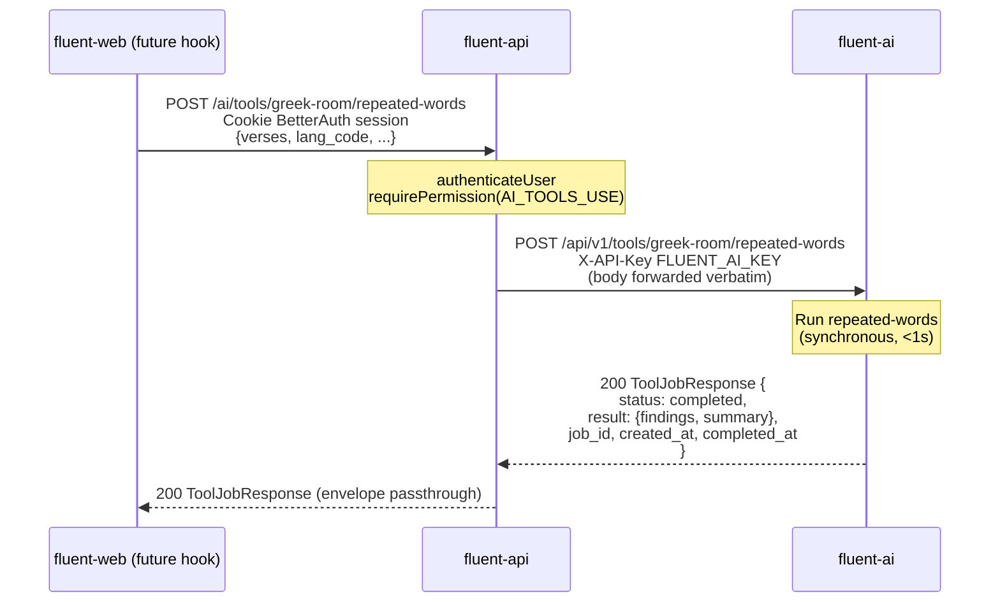
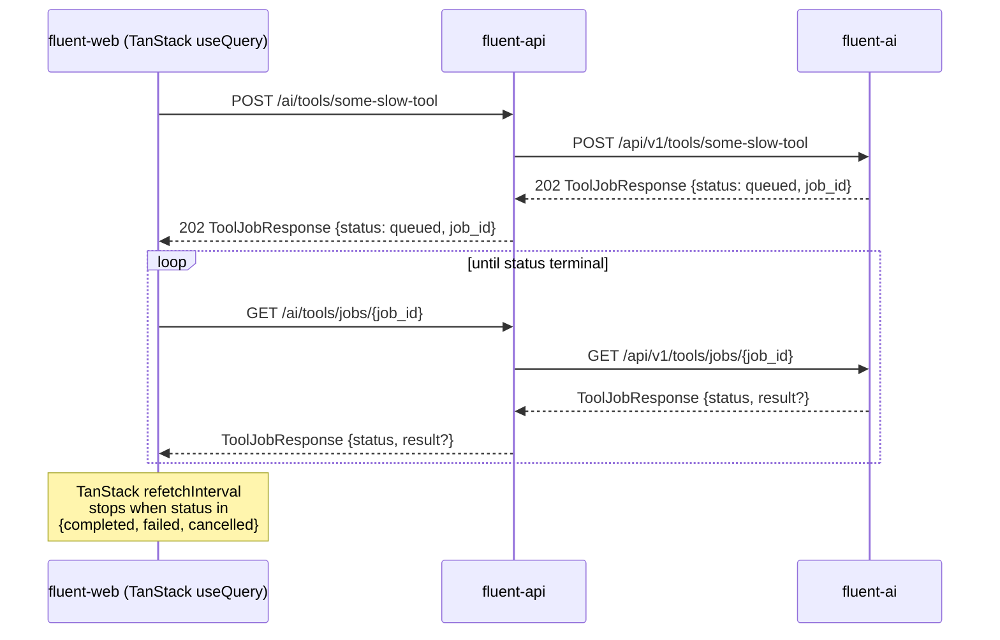

# AI-Tools Integration on fluent-api — Proposal (Part 1 of 2: Contract & Design)

**Status:** Reviewed and **approved** (kaseywright, PR #173, 2026-06-02). Implemented on branch `jel-word-check` — see the implementation-status doc below for what currently exists in the tree.
**Scope:** Extend fluent-api to expose AI tools implemented by fluent-ai, starting with Greek-Room's _Repeated Words_ check. The exposed pattern is meant to absorb every future AI tool (LLM drafting, embeddings, fine-tuning, other Greek-Room checks) without renegotiating the contract.

**This document is Part 1 of 2.** It covers the contract and design: background, scope, decisions, the URL, the file layout, the `callFluentAi` utility, request/response shapes, auth, and error translation (§1–§10).

**Companion documents:**

- [`ai-tools-integration-operations.md`](ai-tools-integration-operations.md) — **Part 2 of 2.** Forward-compatibility (the job-queue protocol), service discovery / Docker / environment wiring (including the step-by-step "wire up a running ecosystem" checklist), testing strategy, future work, and the reviewer Q&A (§11–§15).
- [`ai-tools-integration-status.md`](ai-tools-integration-status.md) — **Implementation status.** What is already implemented in the tree (file-by-file) versus what remains to be done. Start here if you are an agent or developer picking this work up.
- [`ai-tools-integration-summary.md`](ai-tools-integration-summary.md) — short reviewer orientation.

**Predecessors on the fluent-ai side:** [`fluent-ai/greek-room-integration-summary.md`](../../../../fluent-ai/greek-room-integration-summary.md), [`fluent-ai/greek-room-integration-suggestion.md`](../../../../fluent-ai/greek-room-integration-suggestion.md), [`fluent-ai/greek-room-integration-decisions.md`](../../../../fluent-ai/greek-room-integration-decisions.md).

> **Note on document split.** This proposal was split into two files at the §10/§11 boundary so each stays under the repo's markdown line-count lint limit. Sections are numbered continuously across both files (Part 1 ends at §10; Part 2 begins at §11), so all internal "see §N" references remain valid across the pair.

---

## 1. Background

fluent-ai is the Python/FastAPI backend dedicated to AI-tool integrations. It has merged its first such integration — Greek-Room's _Repeated Words_ check — exposed at:

```
POST /api/v1/tools/greek-room/repeated-words
Header: X-API-Key: <key>
```

with a `ToolJobResponse[RepeatedWordsResult]` envelope that already accommodates a future async-queue mode (`status: queued|running|completed|failed|cancelled`, `job_id`, `created_at`, `completed_at`). Today it always returns `status: "completed"` synchronously; the queue substrate is deferred until a slow tool needs it. See the predecessor documents linked above for the full architectural rationale.

fluent-api is the Node/TypeScript backend that fronts the editor (fluent-web). It currently has no awareness of fluent-ai. This proposal describes how to put the _Repeated Words_ check on the menu by routing it through fluent-api, while shaping the integration so the next AI tool drops in with minimum effort.

The user-facing motivation is the editor: eventually each repeated word should get a corrective squiggle below it, similar to a spell-checker. That endgame is **out of scope for this PR**, but it sets the constraint that the surface fluent-api exposes must be cheap and re-callable per editor save, not stateful or session-coupled.

### 1.1 Related repositories

All four sibling projects live under the same GitHub org (`eten-tech-foundation`). Per fluent-platform's setup convention they are cloned side-by-side in the same parent directory.

| Repo                | Remote                                                                                                     | Role                                                                                                                                           |
| ------------------- | ---------------------------------------------------------------------------------------------------------- | ---------------------------------------------------------------------------------------------------------------------------------------------- |
| **fluent-api**      | [github.com/eten-tech-foundation/fluent-api](https://github.com/eten-tech-foundation/fluent-api)           | Node/TypeScript REST API (Hono + Drizzle + BetterAuth). The subject of this proposal.                                                          |
| **fluent-ai**       | [github.com/eten-tech-foundation/fluent-ai](https://github.com/eten-tech-foundation/fluent-ai)             | Python/FastAPI service hosting AI-tool integrations (Greek-Room, future LLM tools). The upstream we are calling into.                          |
| **fluent-platform** | [github.com/eten-tech-foundation/fluent-platform](https://github.com/eten-tech-foundation/fluent-platform) | Container-first orchestrator. Owns the shared PostgreSQL, the unified compose stack, and helper scripts. Touched by this proposal — see §12.4. |
| **fluent-web**      | [github.com/eten-tech-foundation/fluent-web](https://github.com/eten-tech-foundation/fluent-web)           | React/Vite frontend (the editor). Not touched in this PR; the frontend hook is a follow-up.                                                    |

Relative paths in this document (e.g. `../../fluent-platform/...`) assume the standard side-by-side layout that fluent-platform's setup script produces.

---

## 2. Scope of this PR

**In scope (this PR):**

1. A single new endpoint on fluent-api: `POST /ai/tools/greek-room/repeated-words`.
2. A shared utility — `callFluentAi<TReq, TResult>(toolPath, body, schema)` — used by all per-tool routes to handle envelope unwrap, error translation, and (later) polling.
3. A new domain folder, `src/domains/ai-tools/`, containing routes/services/types for tool endpoints.
4. Two new env vars wired through `src/env.ts`: `FLUENT_AI_URL` and `FLUENT_AI_KEY`.
5. A new permission alias `PERMISSIONS.AI_TOOLS_USE` that maps to the same underlying value as `CONTENT_UPDATE`.
6. Tests mirroring the existing fluent-api test patterns plus one smoke test runnable from the host.

**Explicitly deferred (future PRs):**

- Async job polling endpoint on fluent-api (`GET /ai/tools/jobs/{job_id}` or similar). Not built because fluent-ai also has not built the corresponding endpoint yet — both sides chose "lightweight now" per fluent-ai decision **D1**.
- Frontend (fluent-web) hooks and squiggle UI. Frontend is a separate session/PR.
- DB persistence of tool runs / findings. No `ai_tool_runs` or `check_results` table is introduced.
- Net-new cross-repo docker orchestration. The substrate already exists as [`fluent-platform`](../../../../fluent-platform/README.md); this PR adds two small entries (`FLUENT_AI_URL` override) to [`fluent-platform/compose.yaml`](../../../../fluent-platform/compose.yaml) and ships them alongside the fluent-api change. See §12 for details.
- Rate limits, request-size limits, MCP facade, SSE/WebSocket streaming, scheduled runs, multi-tenant fairness. All deferred at the fluent-ai level and inherited here.

---

## 3. Architectural decisions summary

These are the decisions captured during the spec discussion. Each is restated here so reviewers can discuss the conclusion without reading the supporting analysis.

| #       | Decision                                                                                                                                                                                                                                                                                                                                                                                                                                                                                                                                                                                              | Short rationale                                                                                                                                                                                                                                                                                                                                                                                                                                              |
| ------- | ----------------------------------------------------------------------------------------------------------------------------------------------------------------------------------------------------------------------------------------------------------------------------------------------------------------------------------------------------------------------------------------------------------------------------------------------------------------------------------------------------------------------------------------------------------------------------------------------------- | ------------------------------------------------------------------------------------------------------------------------------------------------------------------------------------------------------------------------------------------------------------------------------------------------------------------------------------------------------------------------------------------------------------------------------------------------------------ |
| **D1**  | PR scope is "minimum proxy" — no DB persistence, no job queue exercised in this PR.                                                                                                                                                                                                                                                                                                                                                                                                                                                                                                                   | Repeated-words is fast (<1s) and re-runnable; persistence is not motivated by this tool. Defer until a slow tool justifies a `ai_tool_runs` table.                                                                                                                                                                                                                                                                                                           |
| **D2**  | URL is `POST /ai/tools/greek-room/repeated-words`.                                                                                                                                                                                                                                                                                                                                                                                                                                                                                                                                                    | Introduces `/ai/` as fluent-api's first top-level service-family namespace. Telegraphs "network-bound, potentially slow, possibly async" — characteristics that local CRUD endpoints don't share. Per-tool URL preserves OpenAPI type-safety. Alternatives: `/checks/repeated-words` (more in convention but hides the proxy nature), nested under `/chapter-assignments/{id}/` (requires server-side enrichment which we reject in D8).                     |
| **D3**  | Polling lives in the _browser_ via TanStack Query's `refetchInterval`, not in fluent-api. fluent-api is a thin pass-through for both kickoff and (future) polling.                                                                                                                                                                                                                                                                                                                                                                                                                                    | Decouples slow tools from fluent-api's request budget. Aligns with fluent-web's existing TanStack Query usage. The polling code path is not exercised today because fluent-ai always returns `status: "completed"` synchronously.                                                                                                                                                                                                                            |
| **D4**  | File layout: shared utility at [`fluent-api/src/lib/services/fluent-ai/fluent-ai.client.ts`](../../../src/lib/services/fluent-ai/fluent-ai.client.ts); per-tool routes/services in [`fluent-api/src/domains/ai-tools/`](../../../src/domains/ai-tools/). One route file for all tools; per-tool Zod schemas keep OpenAPI documentation fully typed.                                                                                                                                                                                                                                                   | Mirrors the existing [`fluent-api/src/lib/services/notifications/mailgun.service.ts`](../../../src/lib/services/notifications/mailgun.service.ts) pattern for "free functions wrapping a third-party API" and the existing [`fluent-api/src/lib/db-retry.ts`](../../../src/lib/db-retry.ts) pattern for "higher-order utility used by many call sites." Avoids a single one-size-fits-all dispatcher that would degrade OpenAPI schemas to `dict[str, Any]`. |
| **D5**  | Service discovery / docker networking is handled by the existing [`fluent-platform`](../../../../fluent-platform/README.md) orchestrator. This PR adds two env vars on the fluent-api side and one `environment:` override on the fluent-platform side (`FLUENT_AI_URL: http://ai:8200`). See §12.                                                                                                                                                                                                                                                                                                    | fluent-platform already wires `db`, `api`, `worker`, `ai`, `web` together on a shared network; we plug in to that substrate rather than invent a new one.                                                                                                                                                                                                                                                                                                    |
| **D6**  | A single shared `FLUENT_AI_KEY` is provisioned for the fluent-api → fluent-ai hop. If another consumer of fluent-ai appears later, it gets its own key.                                                                                                                                                                                                                                                                                                                                                                                                                                               | Per-user keys give zero security benefit at this layer (everyone going through fluent-api is already authenticated to fluent-api). Single key minimizes IT complexity.                                                                                                                                                                                                                                                                                       |
| **D7**  | Error translation specifics deferred to implementation. If conformity between the two error systems is awkward, prefer harmonizing fluent-ai toward fluent-api's patterns rather than the other way.                                                                                                                                                                                                                                                                                                                                                                                                  | At the spec level there are no hard constraints; the safe defaults (5xx from fluent-ai → 502 on fluent-api with `ErrorCode.AI_SERVICE_UNAVAILABLE`) are obvious.                                                                                                                                                                                                                                                                                             |
| **D8**  | No request enrichment. fluent-api forwards the request body to fluent-ai verbatim. fluent-web sends the full `RepeatedWordsRequest` shape including `lang_code`, `lang_name`, `project_id`, `project_name`, `verses[]`. **Reviewer-confirmed (kaseywright, 2026-06-02):** forwarding verbatim is approved; the snake*case field naming is an \_intentional, contained* exception to fluent-api's camelCase convention, scoped to the AI-tools domain. See §8.1 — please leave this divergence as-is rather than "normalizing" it to camelCase, since it intentionally mirrors the fluent-ai contract. | Maximum flexibility for the caller. Avoids coupling fluent-api to fluent-ai's request schema (today and tomorrow). The alternatives (per-service renaming or mapper functions) add cost without a corresponding benefit; keeping the divergence contained in the AI-tools domain is the lesser evil.                                                                                                                                                         |
| **D9**  | The full `ToolJobResponse` envelope is passed through to fluent-web unchanged. No unwrap to `result` for the synchronous case. **Reviewer-confirmed (kaseywright, 2026-06-02):** approved on the condition that the response delivered to the web client conforms to the standard response format already in place on fluent-api (see §8.2).                                                                                                                                                                                                                                                          | Forward-compatible with TanStack-based polling — the same hook code consumes the envelope today (`status: completed`) and tomorrow (`status: queued` → polled to `completed`).                                                                                                                                                                                                                                                                               |
| **D10** | Auth on the new endpoint: introduce `PERMISSIONS.AI_TOOLS_USE` as an _alias_ with the same underlying value as `CONTENT_UPDATE`. **Reviewer-confirmed (kaseywright, 2026-06-02):** alias approach approved; the trade-off (flexibility vs. user-results) was noted as acceptable provided the decision is documented here for future reference. See §9.3.                                                                                                                                                                                                                                             | Cosmetically separates "can edit content" from "can invoke AI tools" without making a real distinction yet. Trivial to peel apart later.                                                                                                                                                                                                                                                                                                                     |
| **D11** | A smoke test analogous to [`fluent-ai/scripts/smoke_repeated_words.py`](../../../../fluent-ai/scripts/smoke_repeated_words.py) is added, runnable from the host with both services up.                                                                                                                                                                                                                                                                                                                                                                                                                | Lets devs verify the cross-service plumbing without running the full vitest suite.                                                                                                                                                                                                                                                                                                                                                                           |
| **D12** | This work ships as a **coordinated pair of PRs**: one against fluent-api (the bulk of the work) and one small PR against fluent-platform (compose env-var override + 1–2 README lines). Either order of merge is fine; both should be ready for review together.                                                                                                                                                                                                                                                                                                                                      | The fluent-platform PR is small and contains no logic, so it can land first to unblock ecosystem-mode dev. Reviewers should be able to read both PRs side-by-side.                                                                                                                                                                                                                                                                                           |

---

## 4. End-to-end picture

### 4.1 Today (synchronous, status = "completed")



### 4.2 Tomorrow (async, status = "queued" → polled)



The interesting property: **the request/response shapes are identical** between 4.1 and 4.2. The only difference is `status` and whether `result` is populated. fluent-web's hook composes a `useMutation` for kickoff with a conditional `useQuery` that polls iff `status === "queued" | "running"`.

---

## 5. URL and endpoint shape

### 5.1 The URL

```
POST /ai/tools/greek-room/repeated-words
```

This introduces `/ai/` as fluent-api's first top-level service-family namespace. The full URL inventory survey conducted during the spec session is reproduced in [Appendix A](#appendix-a--fluent-api-url-inventory-at-time-of-writing). Today fluent-api's URLs are flat, plural-noun, unprefixed; nested URLs reflect ownership (`/projects/{id}/users`). There is no existing service-family namespace; `/usfm` _is not_ a top-level prefix but a nested sub-resource under `/project-units/{id}`.

#### Why `/ai/tools/greek-room/repeated-words` over the alternatives

- **`/checks/repeated-words`** would be more in-convention (two segments, domain noun, hides the proxy nature). It was the leading candidate during the spec discussion and is preserved as an alternative. Its weakness is informational: the URL gives no hint about the network hop, which makes it harder to reason about timeouts, error budgets, and observability when the system grows.
- **`/tools/greek-room/repeated-words`** (mirroring fluent-ai exactly) loses the "AI service" signal but keeps the per-tool path. Same departure-from-convention cost as the chosen option, with less informational payload.
- **`/chapter-assignments/{id}/checks/repeated-words`** (nesting under the editable subject) would be the most in-convention nesting style. It is unsuitable here because pass-through input (D8) means the parent ID would not actually be consulted server-side — it would lie about the resource model. Honorable mention only.

#### Forward compatibility under `/ai/`

The path layout makes room for the polling endpoint without name collisions:

- `POST /ai/tools/{family}/{tool-name}` — kickoff (this PR for `greek-room/repeated-words`).
- `GET /ai/tools/jobs/{job_id}` — poll (future, when first slow tool ships).

Note that the existing [`fluent-api/src/domains/usfm/usfm.route.ts`](../../../src/domains/usfm/usfm.route.ts) already owns `GET /jobs/{job_id}` for pg-boss USFM-export polling. **Keeping the AI-tools polling endpoint under `/ai/tools/jobs/{id}` avoids that collision** and lets the two job systems coexist with different response shapes (pg-boss-native vs. fluent-ai's `ToolJobResponse` envelope).

### 5.2 OpenAPI documentation

Each tool gets its own `createRoute({...})` call in [`fluent-api/src/domains/ai-tools/ai-tools.route.ts`](../../../src/domains/ai-tools/ai-tools.route.ts) with:

- A typed `RepeatedWordsRequestSchema` (Zod schema mirroring fluent-ai's `RepeatedWordsRequest`).
- A typed `RepeatedWordsResponseSchema` wrapping the `ToolJobResponse[RepeatedWordsResult]` envelope.
- Proper 4xx/5xx response schemas using the existing `Result<T>` → HTTP-status conventions ([`fluent-api/src/lib/types.ts`](../../../src/lib/types.ts)).

This means the `/reference` Scalar docs at fluent-api's root will display the full request/response shape for each tool. No `dict[str, Any]` degradation. Adding a new tool means adding a new `createRoute(...)` block in the same file, registering it on the OpenAPIHono app — three to ten lines plus schemas.

---

## 6. File layout

```
fluent-api/src/
├── env.ts                                       # +FLUENT_AI_URL, +FLUENT_AI_KEY
│
├── lib/
│   ├── permissions.ts                            # +PERMISSIONS.AI_TOOLS_USE (alias of CONTENT_UPDATE)
│   ├── types.ts                                  # +ErrorCode.AI_SERVICE_UNAVAILABLE, +ErrorCode.AI_TOOL_EXECUTION_FAILED
│   └── services/
│       └── fluent-ai/                            # NEW
│           ├── fluent-ai.client.ts               # callFluentAi<TReq, TResult>(toolPath, body, schema): Result<ToolJobResponse<TResult>>
│           └── fluent-ai.types.ts                # ToolJobResponse<T>, JobStatus union, ToolJobError shape
│
├── domains/
│   └── ai-tools/                                 # NEW
│       ├── ai-tools.route.ts                     # POST /ai/tools/greek-room/repeated-words (per-tool routes go here)
│       ├── ai-tools.service.ts                   # callRepeatedWords(req): one-line wrappers per tool
│       └── ai-tools.types.ts                     # Per-tool Zod schemas: RepeatedWordsRequestSchema, RepeatedWordsResultSchema, ...
│
└── server/
    └── server.ts                                 # Register ai-tools routes (mirrors how existing domains register)
```

### 6.1 Why this layout

The fluent-api codebase already has the right precedent for both pieces:

- **`lib/services/fluent-ai/`** mirrors [`fluent-api/src/lib/services/notifications/mailgun.service.ts`](../../../src/lib/services/notifications/mailgun.service.ts) — free functions exported from a service file under `lib/services/{vendor}/{vendor}.service.ts`. The Mailgun file returns `Promise<Result<T>>` and reads its credentials directly from `process.env`. Our `callFluentAi` follows the same shape.
- **`callFluentAi` as a higher-order utility** mirrors [`fluent-api/src/lib/db-retry.ts`](../../../src/lib/db-retry.ts)'s `withDatabaseRetry<T>(operation, options)` pattern. One shared utility, many call sites, no code duplication, no over-generalization.
- **`domains/ai-tools/`** as a domain folder mirrors every other domain in the codebase (`domains/projects/`, `domains/translated-verses/`, etc.). Routes/services/types separated. Hono `createRoute` per endpoint. `Result<T>` returned from services and converted via `getHttpStatus(error)` in routes.

### 6.2 Why not a generic dispatcher

A generic `POST /ai/dispatch` endpoint accepting `{tool: string, params: unknown}` was considered and rejected (this echoes the fluent-ai-side decision **D2** in [`fluent-ai/greek-room-integration-decisions.md`](../../../../fluent-ai/greek-room-integration-decisions.md)). The reasons are the same in TypeScript-land:

- OpenAPI/Scalar docs would degrade to `unknown` payloads.
- Each new tool would lose its named, typed request/response in the docs.
- Per-tool observability (route-level logging, request-time histograms) becomes harder.
- A future MCP facade can still be layered on top of per-tool URLs without invalidating them.

### 6.3 Why one route file for all tools instead of one per tool

`ai-tools.route.ts` co-locates every tool endpoint so adding a new tool requires touching exactly two files (`ai-tools.service.ts` for the wrapper, `ai-tools.route.ts` for the route + schemas). When this file becomes uncomfortably large (~5+ tools), a split by tool _family_ — `ai-tools.greek-room.route.ts`, `ai-tools.openai.route.ts`, etc. — is the natural next step. Not warranted at one tool.

---

## 7. The shared utility: `callFluentAi`

The single piece of _new mechanism_ this PR introduces is the function in [`fluent-api/src/lib/services/fluent-ai/fluent-ai.client.ts`](../../../src/lib/services/fluent-ai/fluent-ai.client.ts).

### 7.1 Signature

```ts
import { z } from '@hono/zod-openapi';

import type { Result } from '@/lib/types';

import type { ToolJobResponse } from './fluent-ai.types';

export async function callFluentAi<TReq, TResult>(
  toolPath: string, // e.g. 'tools/greek-room/repeated-words' (no leading slash; no /api/v1)
  body: TReq,
  resultSchema: z.ZodType<TResult>, // for runtime validation of the result field on success
  options?: {
    signal?: AbortSignal; // honored if caller wants timeout / cancellation
    timeoutMs?: number; // default 30_000
  }
): Promise<Result<ToolJobResponse<TResult>>>;
```

### 7.2 What it does

1. Reads `env.FLUENT_AI_URL` and `env.FLUENT_AI_KEY` (validated at boot in [`fluent-api/src/env.ts`](../../../src/env.ts)).
2. POSTs to `${FLUENT_AI_URL}/api/v1/${toolPath}` with:
   - `Content-Type: application/json`
   - `X-API-Key: ${FLUENT_AI_KEY}`
   - body serialized as JSON
3. Honors the caller's `AbortSignal` if provided; otherwise applies a default 30-second timeout via a derived signal. (Tunable per-call.)
4. On HTTP-level success (2xx), parses the response body as `ToolJobResponse<TResult>` and validates the `result` field against `resultSchema` _if and only if_ `status === "completed"`. (When status is `queued|running`, `result` is `null` and is not validated.)
5. Returns `{ ok: true, data: envelope }` — note this is the **full envelope**, not the unwrapped result. Callers that care only about the synchronous-completed case can `if (envelope.status === "completed") return envelope.result`. Callers that want to support the future polling case can inspect `envelope.status` and `envelope.job_id`.
6. On HTTP error (4xx/5xx), network error, parse error, or schema-validation error, returns `{ ok: false, error: {...} }` using the error mapping in §9.

### 7.3 What it does **not** do (in this PR)

- It does not poll. A `pollUntilComplete: true` option, or a sibling `pollToolJob(jobId, resultSchema)` function, can be added in the future PR that ships the first slow tool. Today the polling code path is not in scope because fluent-ai has not yet shipped the polling endpoint either.
- It does not cache. Each call is independent. Per-tool caching (e.g. memoizing on `(toolPath, hash(body))`) is a future optimization for expensive idempotent tools.
- It does not retry on transport failure. `withDatabaseRetry`-style retries are intentionally not applied because most AI tool failures are _semantic_, not _transport-flaky_. If a user-facing retry policy is wanted, it belongs at the route layer or in the frontend hook, not in this utility.

### 7.4 Why this shape

Compare it to the existing utilities it's modeled on:

- [`withDatabaseRetry<T>(operation, options)`](../../../src/lib/db-retry.ts) is a higher-order async wrapper. `callFluentAi` is also a higher-order async wrapper, parameterized by request/result types and the runtime Zod schema.
- [`sendInvitationEmail({email, ticketUrl, ...})`](../../../src/lib/services/notifications/mailgun.service.ts) is a free function in `lib/services/` that wraps a third-party API and returns `Promise<Result<T>>`. `callFluentAi` is a free function in `lib/services/` that wraps a third-party API and returns `Promise<Result<T>>`.

The point of `callFluentAi` is **not** to be the only function callers ever touch. Each tool gets a typed wrapper in [`ai-tools.service.ts`](../../../src/domains/ai-tools/ai-tools.service.ts) that calls `callFluentAi` once. The wrapper is what the route file imports; the shared utility is a private implementation detail.

### 7.5 Example per-tool wrapper

```ts
// fluent-api/src/domains/ai-tools/ai-tools.service.ts

import type { ToolJobResponse } from '@/lib/services/fluent-ai/fluent-ai.types';
import type { Result } from '@/lib/types';

import { callFluentAi } from '@/lib/services/fluent-ai/fluent-ai.client';

import type { RepeatedWordsRequest, RepeatedWordsResult } from './ai-tools.types';

import { RepeatedWordsResultSchema } from './ai-tools.types';

export async function callRepeatedWords(
  req: RepeatedWordsRequest
): Promise<Result<ToolJobResponse<RepeatedWordsResult>>> {
  return callFluentAi('tools/greek-room/repeated-words', req, RepeatedWordsResultSchema);
}
```

Adding a future tool (say, `coherence-check`) is the same five-line pattern:

```ts
export async function callCoherenceCheck(
  req: CoherenceCheckRequest
): Promise<Result<ToolJobResponse<CoherenceCheckResult>>> {
  return callFluentAi('tools/some-family/coherence-check', req, CoherenceCheckResultSchema);
}
```

### 7.6 Module-level singleton vs. per-call config

`callFluentAi` reads env at module scope, not per call. This means changing `FLUENT_AI_URL` or `FLUENT_AI_KEY` requires restarting fluent-api — same property as Mailgun, pg-boss, BetterAuth, AppInsights, all of which already work this way in fluent-api. For tests, dependency injection of a base URL is achieved by stubbing `fetch` (vitest's `vi.spyOn(global, 'fetch')`), not by passing config to `callFluentAi`. This matches the existing test conventions in fluent-api.

---

## 8. Request and response shapes

### 8.1 The forward direction (fluent-web → fluent-api → fluent-ai)

Per **D8** (no enrichment), the request body shape on `POST /ai/tools/greek-room/repeated-words` is **identical** to fluent-ai's `RepeatedWordsRequest`. Codified in Zod in [`fluent-api/src/domains/ai-tools/ai-tools.types.ts`](../../../src/domains/ai-tools/ai-tools.types.ts):

```ts
export const VerseInputSchema = z.object({
  snt_id: z.string().min(1),
  text: z.string(),
});

export const RepeatedWordsRequestSchema = z.object({
  lang_code: z.string().min(1),
  lang_name: z.string().min(1),
  project_id: z.union([z.string(), z.number()]),
  project_name: z.string().min(1),
  verses: z.array(VerseInputSchema).min(1),
});

export type RepeatedWordsRequest = z.infer<typeof RepeatedWordsRequestSchema>;
```

Notes:

- `project_id` is intentionally permissive (`string | number`) to match fluent-ai's Pydantic model, which accepts either. fluent-api's own `project.id` is an integer.
- `verses` is required and non-empty (`.min(1)`) so we can fail fast at the route layer rather than incur a round-trip to fluent-ai for a trivially-invalid request.
- The field naming uses fluent-ai's snake_case verbatim (`lang_code`, `snt_id`). This is a deliberate departure from fluent-api's camelCase elsewhere; the alternative (rename in fluent-api, re-rename in fluent-ai) buys nothing and risks drift. The OpenAPI docs make the snake_case visible to the frontend.

> **ℹ️ Intentional convention exception — please leave as-is.** _Reviewer-confirmed by kaseywright on 2026-06-02 ([PR #173, review comment](https://github.com/eten-tech-foundation/fluent-api/pull/173#discussion_r3343677813)); decision **D8**._ The snake*case field names in `src/domains/ai-tools/` and `src/lib/services/fluent-ai/` are an \_intentional* divergence from fluent-api's camelCase convention, kept so the wire contract with fluent-ai stays a verbatim pass-through. The reviewer noted that the naming-case divergence is something he'd normally prefer to avoid, but that the alternatives (per-service renaming or mapper functions) are no more rewarding, so this contained exception is the accepted trade-off. When working in this area, please keep these fields in snake_case rather than "normalizing" them to camelCase — renaming them would silently break the fluent-ai contract. The exception is scoped strictly to the AI-tools domain; the rest of fluent-api remains camelCase.
>
> **Implementation note:** it helps to place a short code comment next to the snake_case Zod schemas (at least in [`ai-tools.types.ts`](../../../src/domains/ai-tools/ai-tools.types.ts) and [`fluent-ai.types.ts`](../../../src/lib/services/fluent-ai/fluent-ai.types.ts)) explaining the convention and linking back to both this decision (**D8** / §8.1) and the originating review comment. The comment is what an AI agent or contributor will actually see at the edit site, so it — alongside this proposal — is the most durable guardrail against an accidental rename. Suggested wording:
>
> ```ts
> // Intentional snake_case — verbatim wire contract with fluent-ai (decision D8).
> // Approved in review: https://github.com/eten-tech-foundation/fluent-api/pull/173#discussion_r3343677813
> // Rationale: docs/proposals/repeated-word-check/ai-tools-integration-suggestion.md §8.1
> // Please keep these in snake_case; renaming to camelCase would break the fluent-ai contract.
> ```

### 8.2 The reverse direction (fluent-ai → fluent-api → fluent-web)

Per **D9** (envelope pass-through), the response body is fluent-ai's `ToolJobResponse[RepeatedWordsResult]` verbatim. The schemas below mirror the live fluent-ai contract — [`fluent-ai/src/app/schemas/greek_room.py`](../../../../fluent-ai/src/app/schemas/greek_room.py) and [`fluent-ai/src/app/schemas/tool_job.py`](../../../../fluent-ai/src/app/schemas/tool_job.py) — and are verified against [`fluent-ai/tests/api/v1/test_greek_room.py`](../../../../fluent-ai/tests/api/v1/test_greek_room.py).

```ts
// fluent-api/src/lib/services/fluent-ai/fluent-ai.types.ts

export type JobStatus = 'queued' | 'running' | 'completed' | 'failed' | 'cancelled';

// Mirrors fluent-ai's ToolError (src/app/schemas/tool_job.py): { code, message, details? }.
export interface ToolJobError {
  code: string; // e.g. 'TOOL_EXECUTION_ERROR'
  message: string;
  details?: unknown;
}

export interface ToolJobResponse<TResult> {
  job_id: string; // UUID
  tool: string; // e.g. 'greek_room.repeated_words'
  status: JobStatus;
  result: TResult | null;
  error: ToolJobError | null;
  created_at: string; // ISO-8601 timestamp
  completed_at: string | null;
}
```

```ts
// fluent-api/src/domains/ai-tools/ai-tools.types.ts (continued)

export const RepeatedWordsFindingSchema = z.object({
  snt_id: z.string(),
  repeated_word: z.string(),
  surf: z.string(),
  start_position: z.number().int().nonnegative(),
  legitimate: z.boolean(),
  // Upstream Greek-Room numeric severity (e.g. 0.1 legitimate, 0.5 suspicious).
  severity: z.number(),
});

export const RepeatedWordsSummarySchema = z.object({
  total_findings: z.number().int().nonnegative(),
  legitimate_count: z.number().int().nonnegative(),
  verse_count: z.number().int().nonnegative(),
});

export const RepeatedWordsResultSchema = z.object({
  // Upstream library identity fields (distinct from the envelope's `tool`).
  lang_code: z.string(),
  provider: z.string(),
  check: z.string(),
  findings: z.array(RepeatedWordsFindingSchema),
  summary: RepeatedWordsSummarySchema,
});

export type RepeatedWordsResult = z.infer<typeof RepeatedWordsResultSchema>;

export const RepeatedWordsResponseSchema = z.object({
  job_id: z.string().uuid(),
  tool: z.literal('greek_room.repeated_words'),
  status: z.enum(['queued', 'running', 'completed', 'failed', 'cancelled']),
  result: RepeatedWordsResultSchema.nullable(),
  error: z
    .object({
      code: z.string(),
      message: z.string(),
      details: z.unknown().optional(),
    })
    .nullable(),
  created_at: z.string().datetime({ offset: true }),
  completed_at: z.string().datetime({ offset: true }).nullable(),
});
```

The `RepeatedWordsResponseSchema` is what the Hono route declares as its 200 response, so OpenAPI docs show the full envelope. fluent-web's hook receives the envelope and inspects `status` and `result` directly.

> **Reviewer condition** — kaseywright, 2026-06-02 ([PR #173, review comment](https://github.com/eten-tech-foundation/fluent-api/pull/173#discussion_r3343642943)); decision **D9**. The envelope pass-through was approved on the condition that the response delivered to the web client conforms to the standard response format already in place on fluent-api. In practice this means: success responses still carry the `ToolJobResponse` envelope verbatim, but error responses use fluent-api's existing `{ error, code, details }` shape via `getHttpStatus` (see §10.3), so fluent-web consumes successes and failures through the same conventions it already uses elsewhere. The implementer should verify this alignment when wiring up the route.

### 8.3 Status codes from fluent-api

| Outcome                                                 | HTTP               | Body                                                                                       |
| ------------------------------------------------------- | ------------------ | ------------------------------------------------------------------------------------------ |
| Tool completed synchronously                            | `200 OK`           | `ToolJobResponse` with `status: "completed"`                                               |
| Tool started asynchronously (future)                    | `202 Accepted`     | `ToolJobResponse` with `status: "queued"`                                                  |
| Caller not authenticated                                | `401 Unauthorized` | fluent-api's standard `Result` error                                                       |
| Caller authenticated but lacks `AI_TOOLS_USE`           | `403 Forbidden`    | fluent-api's standard `Result` error                                                       |
| Request body fails Zod validation                       | `400 Bad Request`  | fluent-api's standard validation error                                                     |
| fluent-ai returns 4xx (bad request, auth failure, etc.) | `502 Bad Gateway`  | fluent-api error with `code: AI_SERVICE_UNAVAILABLE` and the upstream message in `details` |
| fluent-ai returns 5xx                                   | `502 Bad Gateway`  | same as above                                                                              |
| Network timeout / connection refused                    | `502 Bad Gateway`  | same as above                                                                              |
| Envelope `status === "failed"` from fluent-ai           | `502 Bad Gateway`  | fluent-api error with `code: AI_TOOL_EXECUTION_FAILED` and the envelope `error` propagated |

The 502 choice for upstream failures mirrors what fluent-ai itself does for its own upstream tool failures (`ToolExecutionException` → 502 per fluent-ai decision **D6**). It signals "this isn't a problem with the caller's request; the dependency is misbehaving."

---

## 9. Authentication and authorization

### 9.1 Two distinct auth boundaries

| Boundary                | Mechanism                 | Established by          | Established when |
| ----------------------- | ------------------------- | ----------------------- | ---------------- |
| fluent-web → fluent-api | BetterAuth session cookie | This codebase, existing | Pre-existing     |
| fluent-api → fluent-ai  | Single shared `X-API-Key` | This PR, env-driven     | This PR          |

These boundaries do not bridge directly: there is no propagation of "user X is calling this tool" beyond fluent-api. Audit logs on the fluent-ai side will see the single shared identity. If per-user attribution is wanted later, the request envelope can carry an opaque `requested_by` claim — out of scope for this PR.

### 9.2 The route guards

```ts
// fluent-api/src/domains/ai-tools/ai-tools.route.ts (excerpt)

const repeatedWordsRoute = createRoute({
  method: 'post',
  path: '/ai/tools/greek-room/repeated-words',
  middleware: [authenticateUser, requirePermission(PERMISSIONS.AI_TOOLS_USE)] as const,
  request: {
    body: {
      content: {
        'application/json': { schema: RepeatedWordsRequestSchema },
      },
    },
  },
  responses: {
    200: {
      content: { 'application/json': { schema: RepeatedWordsResponseSchema } },
      description: 'Repeated-words check completed',
    },
    202: {
      content: { 'application/json': { schema: RepeatedWordsResponseSchema } },
      description: 'Repeated-words check accepted; poll for result',
    },
    400: { description: 'Invalid request body' },
    401: { description: 'Not authenticated' },
    403: { description: 'Missing AI_TOOLS_USE permission' },
    502: { description: 'Upstream fluent-ai error' },
  },
});
```

### 9.3 `PERMISSIONS.AI_TOOLS_USE`

Per **D10**, this is introduced as an _alias_ of `CONTENT_UPDATE`:

```ts
// fluent-api/src/lib/permissions.ts (excerpt)

export const PERMISSIONS = {
  // ... existing permissions ...
  CONTENT_UPDATE: 'content:update',
  AI_TOOLS_USE: 'content:update', // intentional alias
  // ...
} as const;
```

The alias has the same string value, which means `requirePermission(PERMISSIONS.AI_TOOLS_USE)` resolves to the same check as `requirePermission(PERMISSIONS.CONTENT_UPDATE)`. The semantic separation is **purely cosmetic** today — it documents intent at call sites and reserves the option to break it out into a distinct permission later (with its own DB row in the `permissions` table and its own role mappings) without touching any code that already imports `PERMISSIONS.AI_TOOLS_USE`.

If reviewers prefer a real new permission row from day one, that's a defensible alternative; it costs a migration and seeding work and gives no immediate user-visible benefit. The alias approach was chosen because it's reversible from either direction.

> **Reviewer-confirmed** — kaseywright, 2026-06-02 ([PR #173, review comment](https://github.com/eten-tech-foundation/fluent-api/pull/173#discussion_r3343633722)); decision **D10**. The alias approach is approved. The reviewer noted this as a flexibility-vs-results trade-off that is acceptable provided the decision is documented for future reference — which is the purpose of this note. **Implementation note:** add a short comment beside the alias in [`permissions.ts`](../../../src/lib/permissions.ts) linking back to this decision and the review comment, so the intent is visible at the edit site. For whoever revisits it later: promoting `AI_TOOLS_USE` to a real, distinct permission means adding a row to the `permissions` table, mapping it to the appropriate roles in seed data, and changing only the string value here in [`permissions.ts`](../../../src/lib/permissions.ts) — no call sites that already import `PERMISSIONS.AI_TOOLS_USE` need to change.

### 9.4 The `X-API-Key` for fluent-ai

Per **D6**, fluent-api carries a single `FLUENT_AI_KEY` for _all_ fluent-ai calls. The key is read once at module scope in `callFluentAi`. Rotation is "set new env, restart fluent-api"; fluent-ai supports multiple active keys per its existing `ai_api_keys` table, so old key + new key can coexist briefly during a rolling restart.

---

## 10. Error translation

Per **D7**, the exact mapping is settled at implementation time, and if conformity work surfaces we prefer to harmonize fluent-ai toward fluent-api's patterns. This section describes the _minimum viable_ mapping that the implementation should ship with; reviewers should challenge anything they want changed before coding starts.

### 10.1 New `ErrorCode` entries on fluent-api

Two new entries are added to [`fluent-api/src/lib/types.ts`](../../../src/lib/types.ts)'s `ErrorCode` enum:

```ts
export enum ErrorCode {
  // ... existing entries ...
  AI_SERVICE_UNAVAILABLE = 'AI_SERVICE_UNAVAILABLE',
  AI_TOOL_EXECUTION_FAILED = 'AI_TOOL_EXECUTION_FAILED',
}
```

Both map to HTTP 502 via `ErrorHttpStatus`:

```ts
export const ErrorHttpStatus: Record<ErrorCode, number> = {
  // ... existing entries ...
  [ErrorCode.AI_SERVICE_UNAVAILABLE]: 502,
  [ErrorCode.AI_TOOL_EXECUTION_FAILED]: 502,
};
```

`AI_SERVICE_UNAVAILABLE` covers transport-level / availability problems (network errors, 5xx from fluent-ai, schema parse errors, timeouts). `AI_TOOL_EXECUTION_FAILED` covers the case where fluent-ai successfully returned an envelope with `status: "failed"` — the dependency is _up_ but the tool itself rejected the work.

### 10.2 Mapping table

| Source                                                             | Translates to                                                                                                                                                                                                                                                                                                            |
| ------------------------------------------------------------------ | ------------------------------------------------------------------------------------------------------------------------------------------------------------------------------------------------------------------------------------------------------------------------------------------------------------------------ |
| `fetch` throws (network down, DNS, connection refused)             | `Result.err({ code: AI_SERVICE_UNAVAILABLE, message: 'fluent-ai unreachable', details: { cause: error.message } })`                                                                                                                                                                                                      |
| `fetch` times out (default 30s)                                    | `Result.err({ code: AI_SERVICE_UNAVAILABLE, message: 'fluent-ai request timed out', details: { timeoutMs } })`                                                                                                                                                                                                           |
| fluent-ai returns 5xx                                              | `Result.err({ code: AI_SERVICE_UNAVAILABLE, message: '<upstream>', details: { status, body } })`                                                                                                                                                                                                                         |
| fluent-ai returns 4xx                                              | `Result.err({ code: AI_SERVICE_UNAVAILABLE, message: '<upstream>', details: { status, body } })` — yes, also 502 on our side; 4xx from fluent-ai represents a misconfiguration or a contract drift, neither of which is the _caller's_ fault, so we shield them with 502 rather than relay a 4xx that they cannot act on |
| Response body fails JSON parse or envelope schema validation       | `Result.err({ code: AI_SERVICE_UNAVAILABLE, message: 'malformed response from fluent-ai', details: { cause } })`                                                                                                                                                                                                         |
| Envelope `status === "failed"` (fluent-ai reachable; tool refused) | `Result.err({ code: AI_TOOL_EXECUTION_FAILED, message: envelope.error?.message ?? 'tool execution failed', details: { upstreamCode: envelope.error?.code, ... } })`                                                                                                                                                      |
| Envelope `status === "cancelled"`                                  | Same as `failed` — propagate `AI_TOOL_EXECUTION_FAILED`                                                                                                                                                                                                                                                                  |
| Envelope `status === "completed"`                                  | `Result.ok(envelope)`                                                                                                                                                                                                                                                                                                    |
| Envelope `status === "queued"` or `"running"`                      | `Result.ok(envelope)` — the route layer decides whether to return 200 or 202 based on `status`                                                                                                                                                                                                                           |

### 10.3 Route-level translation

The Hono route handler uses `getHttpStatus(error)` from [`fluent-api/src/lib/types.ts`](../../../src/lib/types.ts) exactly as every existing fluent-api route does. The new `AI_*` codes plug into the same conversion path:

```ts
// fluent-api/src/domains/ai-tools/ai-tools.route.ts (excerpt)

aiToolsRouter.openapi(repeatedWordsRoute, async (c) => {
  const body = c.req.valid('json');
  const result = await callRepeatedWords(body);

  if (!result.ok) {
    return c.json(
      { error: result.error.message, code: result.error.code, details: result.error.details },
      getHttpStatus(result.error)
    );
  }

  const envelope = result.data;
  const status =
    envelope.status === 'completed' ||
    envelope.status === 'failed' ||
    envelope.status === 'cancelled'
      ? 200
      : 202;
  return c.json(envelope, status);
});
```

### 10.4 What's intentionally _not_ in here

- **No automatic retries** on transport failure. The caller (or the frontend hook) decides.
- **No structured "user-facing-vs-internal" error categorization** beyond the `code + message + details` shape that fluent-api already uses everywhere. fluent-web is expected to display `error.message` directly and surface `error.details` only to logged-in admins.
- **No localization of error strings.** Errors from fluent-ai come through as English; that's an upstream concern.

### 10.5 Possible follow-up harmonization with fluent-ai

If during implementation the team finds fluent-ai's error envelope shape (`{type, message, details}`) is awkward to consume on the fluent-api side — e.g. the `type` field collides with TypeScript reserved words at certain call sites, or `details` needs a `Record<string, unknown>` constraint that fluent-ai doesn't enforce — the path of least resistance is to file a small change against fluent-ai to align its error envelope with fluent-api's expectations. Per **D7**, we'd rather change the less-mature fluent-ai shape than introduce a translation layer.

---

## Continued in Part 2

Sections §11 through §15 — the job-queue forward-compatibility protocol, service discovery / Docker / environment wiring (including the **"wire up a running ecosystem"** operational checklist in §12.10), the testing strategy, future work, and the resolved reviewer Q&A — now live in the companion file:

➡️ **[`ai-tools-integration-operations.md`](ai-tools-integration-operations.md) — Part 2 of 2.**

For the file-by-file record of what is already implemented in the tree versus what remains, see **[`ai-tools-integration-status.md`](ai-tools-integration-status.md)**.
